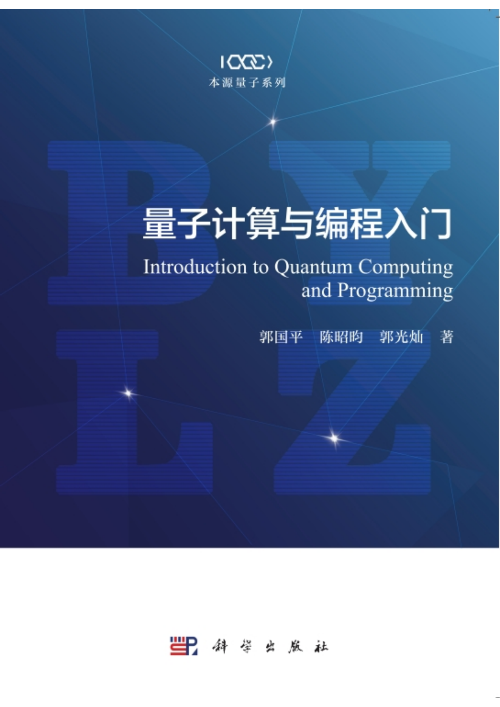

本地阅读：克隆仓库到本地，使用Typora软件打开md后缀文件阅读、编辑。

在线阅读：[在线阅读](https://show.originqc.com.cn/Introduction_to_quantum_computing_and_programming.pdf)

# 《量子计算与编程入门》

 它是国内第一部专业的量子计算与编程教材，可作为“量子程序员”的“第一本学习手册”使用。教材内容深入浅出，抛开复杂的量子力学公式，从量子计算的必要概念入手，结合实操代码，围绕量子计算典型的算
 法进行详细介绍。它简化了量子力学中的神秘复杂概念，覆盖了需要的全部数学知识。对软件、计算机相关背景的量子计算爱好者而言《量子计算与编程入门》是一本相当实用的入门教材。我们希望不懂量子力
 学的你，同样可以实现量子计算入门！

# 目录

序 
前言 

第1章 背景知识

1.1 三问量子计算

1.1.1 什么是量子计算

1.1.2 为什么我们需要量子计算

1.1.3 什么样的机构参与量子计算的研发

1.2 量子计算的发展历史

1.2.1 量子力学的发展

1.2.2 量子计算的发展

1.3 量子计算软件介绍

1.3.1 量子语言 

1.3.2 量子软件开发包

1.3.3 量子云平台

第2章 量子计算基础  

2.1 量子力学基础理论

2.1.1 量子系统

2.1.2 观测量和计算基下的测量

2.1.3 复合系统与联合测量

2.2 量子程序

2.2.1 量子计算原理

2.2.2 量子计算的if和 while

第3章 量子计算机硬件基础

3.1 量子芯片

3.1.1 超导量子芯片

3.1.2 半导体量子芯片

3.1.3 其他类型体系的量子计算体系

3.2 量子计算机硬件

3.2.1 量子芯片支持系统

3.2.2 量子计算机控制系统

3.3 量子计算机

3.3.1 量子计算机整体架构

3.3.2 量子程序架构(设备代码的架构) 

第4章 量子算法与编程

4.1 量子软件开发环境 

4.1.1 QPanda

4.1.2 QRunes

4.1.3 本源量子云平台

4.2 量子算法简介

4.2.1 概述 98 

4.2.2 量子-经典混合算法

4.3 Deutsch-Jozsa算法

4.3.1 在本源量子云平台上实现D-J算法

4.3.2 在QPanda上实现D-J算法

4.4 Grover搜索算法

QPanda实现Grover算法的代码示例

4.5 QAOA

4.5.1 大切割问题  

4.5.2 布尔可满足性问题 

4.5.3 组合优化问题  

4.5.4 近似优化算法  

4.5.5 泡利算符

4.5.6 哈密顿量

4.5.7 算法原理  

4.5.8 QAOA综合示例 

4.6 VQE算法

4.6.1 计算化学 

4.6.2 量子化学 

4.6.3 量子化学模拟

4.6.4 费米子哈密顿量 

4.6.5 算法原理

4.6.6 综合示例

4.7 Shor分解算法

4.7.1 加密与解密

4.7.2 RSA加密算法

4.7.3 量子逻辑电路及量子傅里叶变换

4.7.4 算法原理

4.7.5 pyQPanda中的示例

第5章 量子计算前沿话题

5.1 利用QPanda测试量子系统噪声

5.1.1 量子噪声

5.1.2 含噪声量子虚拟机

5.2 量子机器学习

5.3 使用单振幅和部分振幅量子虚拟机

5.3.1 单振幅量子虚拟机

5.3.2 部分振幅量子虚拟机

5.4 将量子程序编译到不同的量子芯片上

附录

附录A 量子计算数学基础

A.1 概述

A.2 集合与映射

A.3 向量空间

A.4 矩阵与矩阵的运算

A.5 矩阵的特征

A.6 矩阵的函数

A.7 线性算子与矩阵表示

附录B 量子编程工具的安装与配置

B.1 QPanda

B.2 pyQPanda

B.3 Qurator

B.4 量子学习机

附录C 量子化学工具的安装与使用

C.1 PSI4的安装与使用

C.2 可视化化学模拟软件ChemiQ安装与使用

C.3 ChemiQ接口介绍与使用

C.4 非梯度下降算法实现VQE算法代码示例

参考文献

后记
