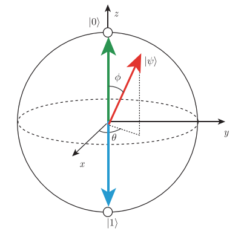

# 第2章 量子计算基础

> 2.1 量子力学基础理论
>
> 2.2 量子程序


## 2.1 量子力学基础理论

###  2.1.1 量子系统

&emsp;&emsp;对于一个非物理专业的人而言，量子力学概念晦涩难懂。鉴于此，本章节仅介绍量子力学的一些基础概念加之部分数学的相关知识，甚至不涉及薛定谔方程，就足够开始量子计算机的应用。这如同不需去了解CPU的工作原理以及经典计算机的组成原理，但仍能在日常生活中使用经典计算机或者编写经典程序一样。

&emsp;&emsp;在本章里，彻底抛却数学公式，纯粹去介绍宽泛的概念，目的仅仅想让读者都能了解这个问题——“量子究竟是什么”。

&emsp;&emsp;如果不想被量子的诡异事实所颠覆，并且对于线性代数很有把握的话，那么可以直接过渡到本教材的后面章节开始学习。

**1.量子化 Quantization与量子态 Quantum State**

&emsp;&emsp;简而言之，量子态就是一个微观粒子的状态。

&emsp;&emsp;描述一个粒子的状态时，总要找一些能够用来区分微观粒子的属性。如图2.1.1，在宏观世界中，假设一个人在一栋楼中活动，如果他在一层，就称处于”1态”；在二层，就称处于“2态”；在地下一层，就称处于“-1 态”。微观粒子也有这样的属性，比如它的位置。


<div align = "center">图2.1.1 一个人在一栋楼中活动</div>

&emsp;&emsp;但是假设这个人正在上楼梯，进入到一个模糊的状态，这样就不太容易区分到底是在“1态”还是“2态”，此时就需要找一些客观存在的参数去描述这一方面的属性，比如所处的海拔。通常，在日常生活中，这些描述都是连续的，因为这些参数会被分割成更小的部分。

&emsp;&emsp;然而，无限分割下去，直到不得不靠“几个原子”这种单位去描述物体的长度时，量子效应就出场了。薛定谔方程告诉人们，一定会遇到不可分割的最小单位，这种最小单位，统称为量子；这种现象，被称为量子化。这是量子的第一个特性。

&emsp;&emsp;量子化的属性有很多种，但在此优先考虑一种——能量。经过长期探索得知，原子的光谱只会有几个峰值，而不是连续的谱线，这代表了原子内电子的能量只会出现几种情况，电子不可能具有几种情况之外的中间值，这就是能量的量子化。每一种能量，被称之为一个“能级”。

&emsp;&emsp;同样以一栋楼为例，在微观的世界里面，一栋楼的楼梯被拆掉了，这使得微观粒子要么在一楼，要么在二楼，仅存在于整数的楼层，但是，这不代表微观粒子就失去了上下楼的机会。这里就是量子的第二个特性——跃迁。

&emsp;&emsp;当一个原子中的电子获得了来自原子外的能量时，它就有可能克服能级之间能量的差距，跳跃到另外一个态上面，并且这个电子也可以将自己的能量释放出来，跳跃到能量较低的能级上面。当然，能级本身是稳定的，不管怎么跃迁，电子的能量都只能处在这几个能级上，这是原则。

&emsp;&emsp;最后，回顾下什么是量子态呢？你可以想象一下电子处在不同的能级（类似宏观世界的楼层）上面，给这些楼层命名称之 $$|1F\rangle$$,$$|2F\rangle$$,$$|3F\rangle$$……，电子处于不同的能级就说明它处在不同的量子态，这样就可以区分出来不同的量子态。如果能想象到此种情形，那就已经明白了什么是量子态了。

**2.量子叠加性 Quantum Superposition**

&emsp;&emsp;如果仅仅是把能级建成大楼，然后把大楼的楼梯、电梯全拆掉，（并且不追问原因）这件事情倒也不难理解，然而剩余部分，就无法用普通的现实去想象了。

&emsp;&emsp;量子叠加性是量子的第三个特性。量子理论中，薛定谔的猫的故事是量子叠加性的一个典型示例，故事的末尾告诉我们：猫处于生与死的叠加态。什么是生与死的叠加态？既生又死？实际上，这个故事是关于量子叠加性的一个有争议的思想实验。


<div align = "center">图2.1.2 薛定谔的猫实验</div>

&emsp;&emsp;首先，必须接受一个假设，即量子的世界里面，同时存在几个状态是可能的。就像这栋楼里面的每个人，在不去观察他们时，他们同时存在于所有楼层，这就是量子叠加性。

&emsp;&emsp;但或许大家会有疑问，即便在现实生活中，也无法得知一栋大楼里面任何一个人的位置，最多了解他在办公桌上坐着的概率比较大而已，那这样就是量子叠加性吗？很遗憾，并非如此。因为某一时刻，即便无法确定，但这个人肯定存在于这栋楼某一个位置，不可能出现在这栋楼不同的位置，量子叠加不是一种“概率性”存在，事实上，对于量子本身，它就是“同时存在”于很多状态的叠加上。经过无数的实验证明，当物体小到分子、原子、电子那个级别的时候，叠加是客观存在的，尽管无人知道原因。

&emsp;&emsp;那么为什么我们感受不到叠加性呢？如果每个粒子都有这种叠加性，那是不是作为粒子组合的人也应该具有叠加性呢？

&emsp;&emsp;一个宏观物体是由巨大数量的粒子构成的集合体。一个粒子虽然是叠加的，但是一群粒子就能开始体现统计的平均性，就像连续扔一百次硬币，还是有可能出现全部是正面的情况，但是扔一亿次硬币的时候（如果没有做假），那会得到一个趋于稳定的结果——正反面各一半。何况每个人身体里的粒子比一亿还要多几亿倍的几亿倍（差不多有27 ∼ 28位数那么多），所以人是绝无可能有叠加性的。

**3.状态的演化 Evolution of State**

&emsp;&emsp;状态的演化是指量子态随时间发生变化。对于一个两能级的量子系统，量子状态的演化类似于地球上的位置随时间变化一样，量子态可以想象成一个单位球面上的点，它随时间演化就同球面上点的位置随时间发生变化类似。

**4.测量和坍缩 Measurement And Collapse**

&emsp;&emsp;薛定谔宣称，不打开盒子，猫就处于生和死的“叠加态”，又称：“当我们打开盒子，经过了我们的观察，猫就会坍缩到一个确定的生、死状态上”。


<div align = "center">图2.1.3 薛定谔的猫</div>


&emsp;&emsp;什么叫做“观察”之后“坍缩”到确定的状态上？难道不是这个装置而是第一个看到猫的人决定了猫的生死吗？

&emsp;&emsp;这里提出量子的第四个特性：“测量和坍缩假设”。测量和坍缩对量子态的影响仍然是一个争议话题，所以用了“假设”。这个特性的描述如下：

&emsp;&emsp;对于一个叠加态而言，可以去测量它，测量的结果一定是这一组量子化之后的、确定的、分立的态中的一个。测量得到任意的态的概率是这个叠加态和测量态的内积的平方，测量之后，叠加态就会坍缩到这个确定的态之上。

&emsp;&emsp;简而言之，如果在一个微观粒子处在1楼和2楼叠加态的话，只能测出来它在1楼或者2楼，这个概率是由它们的叠加权重决定的，但是一旦对这个粒子进行测量，这个粒子的状态就会发生变化，不再是原来那个既在1楼又在2楼的叠加态，而是处在一个确定的状态（1楼或者2楼）。换句话说，测量影响了这个粒子本身的状态。
&emsp;&emsp;在上一节中，已经说明了叠加本身是一种客观存在的现象，那么测量、观察这种主观的事情是如何影响到客观叠加的呢？

&emsp;&emsp;比较主流的理论是说因为微观粒子太小，测量仪器本身会对这个粒子产生一定的影响，导致粒子本身发生了变化。但是没有足够的证据证明这种说法。

&emsp;&emsp;回到薛定谔的猫。薛定谔之所以提出这个思想实验，是想让宏观事物——猫，和微观事物——放射性原子，建立“纠缠”，从而把量子力学的诡异现象从微观世界引到现实世界中来。“如果我们承认微观粒子具有这些“叠加“、”坍缩“的性质的话，那猫也具有了”——这是薛定谔的思想。关于这个问题，目前并没有确切的证据证明猫不是处于这样的状态。

&emsp;&emsp;通过形象的描述介绍了量子力学的一些基础概念，下面将用数学的方式将这些概念重新表述一遍。（阅读下面的内容需要一定的数理基础，包括高等数学，线性代数，概率论中的基本概念。）

**1）态矢 State Vector**

&emsp;&emsp;量子态可用线性代数中的向量来描述，在物理学中，向量常称作矢量。在量子理论中，描述量子态的向量称为态矢，态矢分为左矢和右矢。

&emsp;&emsp;右矢（ket）： $$ |\psi\rangle=\left[\mathrm{c}_{1}, c_{2}, \ldots, c_{n}\right]^{T} $$

&emsp;&emsp;左矢（bra）： $$\langle\psi|=\left[\mathrm{c}_{1}^{*}, c_{2}^{*}, \ldots, c_{n}^{*}\right]$$ 

&emsp;&emsp;采用竖线和尖括号的组合描述一个量子态，其中每一个分量都是复数，右上角标$$T$$表示转置。这种形式表示量子态是一个矢量。右矢表示一个 $$n \times 1$$的列矢量，左矢表示一个 $$1 \times n$$ 的行矢量。另外，在讨论同一个问题时，如果左矢和右矢在括号内的描述相同的话，那么这两个矢量互为转置共轭。

**2）内积和外积**

&emsp;&emsp;对于任意的两个量子态的矩阵（坐标）表示如下：

$$
\begin{aligned}
&|\alpha\rangle=\left[a_{1}, a_{2}, \ldots, a_{n}\right]^{T} \\
&|\beta\rangle=\left[b_{1}, b_{2}, \ldots, b_{n}\right]^{T}
\end{aligned}
$$
&emsp;&emsp;其内积定义为：

$$
\langle\alpha \mid \beta\rangle=\sum_{i=1}^{n} a_{i}^{*} b_{i}
$$

&emsp;&emsp;其外积定义为：

$$
|\alpha\rangle\langle\beta|=\left[a_{i} b^{*}_{j} \right]_{n \times n}
$$


&emsp;&emsp;表示一个 $$n\times n$$ 矩阵。

**5.两能级系统 Two Level System**

&emsp;&emsp;事物的二元化：0和1、无和有、高和低、开和关、天和地、阴和阳、生和死、产生和消灭。二元化是一种将事物关系简化的哲学，基于二进制的计算理论正是利用了这种哲学思想。

&emsp;&emsp;在谈论量子计算原理前，先了解经典计算机的工作流程。经典计算机就是在不断地处理0、1的二进制数码，它们代表着逻辑电路中的高低电平，对于这些二进制数码的产生、传输、处理、读取，最终反馈到像显示器这种输出设备上的信号，就是一个计算机的工作流程。

&emsp;&emsp;对于微观量子而言，有一个决定粒子性质的最直接参量——能量。粒子的能量只会在几个分立的能级上面取值，限制取值的可能性种类为两种，这就构成了两能级系统。除了某些特殊的情况之外，这两个能级必定能找出来一个较低的，称之为基态(ground state)，记为$$|\mathrm{g}\rangle$$；另一个能量较高的，称之为激发态(excited state)，记为 $$|\mathrm{e}\rangle$$。

&emsp;&emsp;量子计算机里面也由两种状态来构成基本计算单元，只不过这里的两种状态是指量子态的 $$|\mathrm{e}\rangle$$ 和 $$|\mathrm{g}\rangle$$，这就是一个两能级系统的特征。以列矢量的方式将它们记为

$$
|\mathrm{e}\rangle=\left[\begin{array}{l}
1 \\
0
\end{array}\right],|\mathrm{g}\rangle=\left[\begin{array}{l}
0 \\
1
\end{array}\right]
$$
​		行矢量的形式记为
$$
\langle\mathrm{e}|=\left[\begin{array}{ll}
1 & 0
\end{array}\right],\langle\mathrm{g}|=\left[\begin{array}{ll}
0 & 1
\end{array}\right]
$$

&emsp;&emsp;和经典的比特类比，常将$$|\mathrm{e}\rangle$$记做$$|0\rangle$$，将$$|\mathrm{g}\rangle$$记做，并称$$|\mathrm{1}\rangle$$之为量子比特（quantum bits）。

&emsp;&emsp;任意叠加态（superposition）$$|\psi\rangle$$ 可以写作和$$|\mathrm{0}\rangle$$的线$$|\mathrm{1}\rangle$$性组合

$$
|\psi\rangle=\alpha|0\rangle+\beta|1\rangle
$$

&emsp;&emsp;其中复数$$\alpha$$ 和 $$\beta$$ 称为振幅（amplitudes），并且满足归一化条件

$$
|\alpha|^{2}+|\beta|^{2}=1
$$

&emsp;&emsp;其中 $$|\alpha|$$ 表示复数 $$\alpha$$ 的模。

**6.状态的演化 Evolution of State**

&emsp;&emsp;量子态可以由态矢（或称向量）来表示，量子也可以有不同的状态，并且可以同时处于不同的状态，那么量子态是如何随时间演化呢？如下例：

&emsp;&emsp;假设：封闭的(closed)量子系统的演化（evolution）由酉变换（unitary transformation）来描述。具体地，在$$t_1$$时刻系统处于状态$$|\psi_1 \rangle$$ ，经过一个和时间 $$t_1$$ 和 $$t_2$$ 有关的酉变换 $$U$$ ，系统在 $$t_2$$ 时刻的状态

$$
\left|\psi_{2}\right\rangle=U\left|\psi_{1}\right\rangle
$$

&emsp;&emsp;这里的酉变换$$U$$可以理解为是一个矩阵，并且满足

$$
U U^{\dagger}=I
$$

&emsp;&emsp;其中$$U^{\dagger}$$表示对矩阵$$U$$取转置共轭。根据可逆矩阵的定义可知， $$U$$也是一个可逆矩阵，因此酉变换也是一个可逆变换。

&emsp;&emsp;而在量子计算中，各种形式的酉矩阵被称作量子门。例如Pauli矩阵也是一组酉矩阵，

$$
\begin{aligned}
&\sigma_{0} \equiv I \equiv\left[\begin{array}{ll}
1 & 0 \\
0 & 1
\end{array}\right] \quad \sigma_{1} \equiv \sigma_{x} \equiv X \equiv\left[\begin{array}{ll}
0 & 1 \\
1 & 0
\end{array}\right] \\
&\sigma_{2} \equiv \sigma_{y} \equiv Y \equiv\left[\begin{array}{cc}
0 & -i \\
i & 0
\end{array}\right] \quad \sigma_{3} \equiv \sigma_{z} \equiv Z \equiv\left[\begin{array}{cc}
1 & 0 \\
0 & -1
\end{array}\right]
\end{aligned}
$$

&emsp;&emsp;以X 门作用在量子态上为例，

$$
\begin{aligned}
&X|0\rangle=\left[\begin{array}{ll}
0 & 1 \\
1 & 0
\end{array}\right]\left[\begin{array}{l}
1 \\
0
\end{array}\right]=\left[\begin{array}{l}
0 \\
1
\end{array}\right]=|1\rangle \\
&X|1\rangle=\left[\begin{array}{ll}
0 & 1 \\
1 & 0
\end{array}\right]\left[\begin{array}{l}
0 \\
1
\end{array}\right]=\left[\begin{array}{l}
1 \\
0
\end{array}\right]=|0\rangle
\end{aligned}
$$

再如 $$X$$门作用在任意的量子态$$|\psi\rangle=\alpha|0\rangle+\beta|1\rangle$$ 上

$$
X|\psi\rangle=\left[\begin{array}{ll}
0 & 1 \\
1 & 0
\end{array}\right]\left[\begin{array}{l}
\alpha \\
\beta
\end{array}\right]=\left[\begin{array}{c}
\beta \\
\alpha
\end{array}\right]
$$

&emsp;&emsp;从上述中看出，量子态的演化本质上可以看作是对量子态对应的矩阵做变换，即是做矩阵的乘法。 由于$$X$$门和经典逻辑门中的非门类似，有时也常称$$X$$ 门为量子非门（quantum NOT gate)。

**7.叠加态和测量 Superposition State And Measurement**

&emsp;&emsp;按照态矢的描述，这两个矢量可以构成一个二维空间的基。任何一个态都可以写为这两个基在复数空间上的线性组合，即

$$
|\psi\rangle=\alpha|0\rangle+\beta e^{i {\theta}}|1\rangle
$$

&emsp;&emsp;其中 $$e^{i \theta}$$ 表示模为1幅角为 $$\theta$$ 的复数。

&emsp;&emsp;可以定义测量就是将量子态$$|\psi\rangle$$投影到另一个态$$ |\alpha\rangle$$上。获得这个态的概率是它们内积的平方，即

$$
P_{\alpha}=|\langle\psi \mid \alpha\rangle|^{2}
$$

&emsp;&emsp;其它概率下会将量子态投影到它的正交态上去，即

$$
P_{\alpha \perp}=1-P_{\alpha}
$$

测量之后量子态就坍缩到测量到的态上。

**8.相位、纯态和混合态 Phase, Pure State and Mixed State**

&emsp;&emsp;如果将量子态初始化到某一个未知的叠加态上面，能否通过反复的测量得到它的表达式呢？看以下这两种情况：

$$
\begin{aligned}
&\left|\psi_{1}\right\rangle=\frac{1}{\sqrt{2}}(|0\rangle+|1\rangle) \\
&\left|\psi_{2}\right\rangle=\frac{1}{\sqrt{2}}(|0\rangle-|1\rangle)
\end{aligned}
$$

&emsp;&emsp;发现在 $$|0\rangle$$，$$|1\rangle$$ 的方向上测量，它们的表现都是一半概率为0，一半概率为1，根本不能区分。从这个现象可以知道无法通过概率得到态的相位信息 $$\theta$$，实际上，量子态的相位是量子相干性的体现。

&emsp;&emsp;另一种情况，假设左手抓着一个袋子，这个袋子里面有无数的量子态，它们全都是$$\left|\psi_{1}\right\rangle=\frac{1}{\sqrt{2}}(|0\rangle+|1\rangle)$$ 这种叠加态；另外，有一个机器可以在$$|0\rangle$$，$$|1\rangle$$的方向上测量。

&emsp;&emsp;每次拿出一个态，对它进行测量，不管它是$$|0\rangle$$，还是$$|1\rangle$$，都扔到右手边的另一个袋子里面，如此反复，这样右边袋子里面的态越来越多了。由于测量结果对于这两种情况是等概率的，所以袋子里面约有一半的态是$$|0\rangle$$，另一半是$$|1\rangle$$。

&emsp;&emsp;假设从右边的袋子里取出一个，在不知道手上的态是什么情况下，能说它和左边袋子里的态一样都是$$\frac{1}{\sqrt{2}}(|0\rangle+|1\rangle)$$ 吗？

&emsp;&emsp;答案是不能。右边袋子里的态，实际上是一种经典的概率叠加，和等量的红球白球装在袋子里面一样。这样的态是不具有相位的。它只能表示为

$$
\left\{\left|\psi_{0}\right\rangle=|0\rangle: P_{0}=0.5,\left|\psi_{1}\right\rangle=|1\rangle: P_{1}=0.5\right\}
$$

&emsp;&emsp;这种类似于概率列表的形式。

&emsp;&emsp;所以，定义纯态就是“纯粹的量子态”，它不仅具有概率，还具有相位（也就是量子相干性）。混合态是纯态的概率性叠加，它往往失去了（部分或全部的）相位信息。

**9.密度矩阵和布洛赫球 Density Matrix And Bloch Sphere**

&emsp;&emsp;态矢是对纯态的描述，如果要描述一个混合态，就必须写成态集合和概率的列表形式，非常繁琐。因此采用密度矩阵来描述。

&emsp;&emsp;对于一个纯态而言，密度矩阵的形式是：

$$
\rho=|\psi\rangle\langle\psi|
$$

&emsp;&emsp;而对于一个混合态而言，密度矩阵的形式是：

$$
\rho=\sum_{i} P_{i}\left|\psi_{i}\right\rangle\left\langle\psi_{i}\right|
$$

&emsp;&emsp;其中$$\left\{P_{i}\left|\psi_{i}\right\rangle\right\}$$是系统所处的态及其概率。

&emsp;&emsp;密度矩阵有以下的性质：

&emsp;&emsp;对于一个两能级体系表述的态，不论是纯的还是混合的，都可以用密度矩阵 $$\rho$$ 表示

$$\rho=\rho^{2}$$当且仅当量子态是纯态时成立。

&emsp;&emsp;$$\rho$$对角线上的分量表示整个系统如果经历一次测量，那么可以得到这个态的概率。如果只去操作和测量一个两能级体系，那么是分辨不出相同的密度矩阵的。

&emsp;&emsp;密度矩阵已经完备地表示了一个两能级系统可能出现的任何状态。为了更加直观地理解量子叠加态与逻辑门的作用，引入布洛赫球的概念，如图2.1.4，它能够方便地表示一个量子比特的任意状态。

</img>

<div align = "center">图2.1.4  布洛赫球</div>

&emsp;&emsp;如果量子态是一个纯态，那么它是球面上的点。点的$$z$$坐标衡量了它的 $$|0\rangle$$ 和 $$|1\rangle$$ 的概率，即

$$
\begin{aligned}
&P(0)=\frac{1+z}{2} \\
&P(1)=\frac{1-z}{2}
\end{aligned}
$$

&emsp;&emsp;最上面表示 $$|0\rangle$$态，最下面表示$$|1\rangle$$ 态。

&emsp;&emsp;再沿着平行于$$XY$$平面的方向，并且穿过这个点的$$Z$$坐标，可以得到一个圆，这个圆就象征着相位的复平面；这个点在这个圆上交$$X$$轴的角度就是单位复数的幅角。经过这个过程可以将每个纯态都与球面上的点一一对应了起来。

&emsp;&emsp;对于混合态而言，因为根据之前的描述，混合态实际上是多个纯态的经典统计概率的叠加。对于每一个纯态分量，连接球心和球面上的点，可以形成一个矢量。根据概率列表，对所有的纯态矢量进行加权平均，即可得到混合态的矢量，即得到了混合态对应的点。

&emsp;&emsp;混合态是布洛赫球内部的点，根据混合的程度不同，矢量的长度也不同。最大混合态是球心，它意味着这里不存在任何量子叠加性。

&emsp;&emsp;例如$$(1,0,0)$$和$$(-1,0,0)$$点在布洛赫球上就是在$$X$$方向上的顶点和$$-X$$方向上的顶点。它们对应的量子态的概率分布就是$$Z$$坐标，即为$$0$$​。所以，

$$
P 0(|\psi _{1}\rangle)=P 0(|\psi _{2}\rangle)=0.5
$$

&emsp;&emsp;沿$$XY$$平面横切，得到一个圆，可以看到这两个点对应的幅角是$$\theta_1 =0$$，$$\theta_2 = \pi$$，由此推断出量子态分别为：

$$
\begin{aligned}
&\left|\psi_{1}\right\rangle=\frac{1}{\sqrt{2}}(|0\rangle+|1\rangle) \\
&\left|\psi_{2}\right\rangle=\frac{1}{\sqrt{2}}(|0\rangle-|1\rangle)
\end{aligned}
$$

&emsp;&emsp;如果将这两个态以$$1/2$$, $$1/2$$的概率混合，在布洛赫球上面的坐标将表示为$$(0,0,0)$$，也就是球心。对应到密度矩阵的表述，为：

$$
\rho=\frac{1}{2}|\psi_{1}\rangle\langle\psi_{1} |+\frac{1}{2}|\ \psi_{2}\rangle\langle\psi_{2}| \ =\left[\begin{array}{cc}
0.5 & 0 \\
0 & 0.5
\end{array}\right]
$$

&emsp;&emsp;即为最大混合态。


###  2.1.2 观测量和计算基下的测量

&emsp;&emsp;量子比特（qubit）不同于经典的比特（bit），一个量子比特$$|\psi\rangle$$可以同时处于$$|0 \rangle$$和$$|1 \rangle$$两个状态，可用线性代数中的线性组合（linear combination)来表示为

$$
|\psi\rangle=\alpha|0\rangle+\beta|1\rangle
$$


&emsp;&emsp;在量子力学中常称量子比特$$|\psi\rangle$$处于$$|0\rangle$$和$$|1\rangle$$的叠加态（superpositions），其中α、β都是复数（complex number），两维复向量空间的一组标准正交基（orthonormal basis）组成一$$|0 \rangle$$和$$|1 \rangle$$组计算基（computational basis)。

&emsp;&emsp;量子比特的信息不能直接获取，而是通过测量来获取量子比特的可观测的信息。可观测量在量子理论中由自伴算子（self-adjoint operators）来表征，自伴的有时也称Hermitian。量子理论中的可观测量与经典力学中的动力学量，如位置、动量和角动量等对应，而系统的其他特征，如质量或电荷，并不在可观测量的类别之中，它是作为参数被引入到系统的哈密顿量（Hamiltonian）。

&emsp;&emsp;在量子力学中测量（measure）会导致坍塌，即是说测量会影响到原来的量子状态，因此量子状态的全部信息不可能通过一次测量得到。当对量子比特$$|\psi\rangle$$进行测量时，仅能得到该量子比特概率$$|\alpha|^2$$处在$$|0 \rangle$$态，或概率$$|\beta|^2$$处在$$|1 \rangle$$态。由于所有情况的概率和为$$1$$，则有$$|\alpha|^{2}+|\beta|^{2}=1$$。

&emsp;&emsp;当对量子进行测量时，会发生什么变化呢？ 

&emsp;&emsp;假设：量子测量是由测量算子（measurement operators）的集合$$\left\{M_{i}\right\}$$来描述，这些算子可以作用在待测量系统的状态空间（state space）上。指标（index）$$i$$ 表示在实验上可能发生的结果。如果测量前的量子系统处在最新状态$$|\psi\rangle$$，那么结果 $$i$$​ 发生的概率为

$$
p(i)=\left\langle\psi\left|M_{i}^{\dagger} M_{i}\right| \psi\right\rangle
$$


&emsp;&emsp;并且测量后的系统状态变为

$$
\frac{M_{i}|\psi\rangle}{\sqrt{\left\langle\psi\left|M_{i}^{\dagger} M_{i}\right| \psi\right\rangle}}
$$


&emsp;&emsp;由于所有可能情况的概率和为$$1$$​，即

$$
1=\sum_{i} p(i)=\sum_{i}\left\langle\psi\left|M_{i}^{\dagger} M_{i}\right| \psi\right\rangle
$$

&emsp;&emsp;因此，测量算子需满足

$$
\sum_{i} M_{i}^{\dagger} M_{i}=I
$$


&emsp;&emsp;该方程被称为完备性方程（completeness equation）。

&emsp;&emsp;再例如，在计算基下单量子比特的测量。单量子比特在计算基下有两个测量算子，分别是$$M_{0}=|0\rangle\left\langle 0\left|, M_{1}=\right| 1\right\rangle\langle 1|$$​。注意到这两个测量算子都是自伴的，即

$$
M_{0}^{\dagger}=M_{0}, M_{1}^{\dagger}=M_{1}
$$

&emsp;&emsp;且

$$
M_{0}^{2}=M_{0}, M_{1}^{2}=M_{1}
$$


&emsp;&emsp;因此

$$
M_{0}^{\dagger} M_{0}+M_{1}^{\dagger} M_{1}=M_{0}+M_{1}=I
$$

&emsp;&emsp;该测量算子满足完备性方程。

&emsp;&emsp;设系统被测量时的状态是$$|\psi\rangle=\alpha|0\rangle+\beta|1\rangle$$ ，则测量结果为$$0$$的概率为

$$
p(0)=\left\langle\psi\left|M_{0}^{\dagger} M_{0}\right| \psi\right\rangle=\left\langle\psi\left|M_{0}\right| \psi\right\rangle=|\alpha|^{2}
$$


&emsp;&emsp;对应测量后的状态为

$$
\frac{M_{0}|\psi\rangle}{\sqrt{\left\langle\psi\left|M_{0}^{\dagger} M_{0}\right| \psi\right\rangle}}=\frac{M_{0}|\psi\rangle}{|\alpha|}=\frac{\alpha}{|\alpha|}|0\rangle
$$

&emsp;&emsp;测量结果为1的概率为

$$
p(1)=\left\langle\psi\left|M_{1}^{\dagger} M_{1}\right| \psi\right\rangle=\left\langle\psi\left|M_{1}\right| \psi\right\rangle=|\beta|^{2}
$$


&emsp;&emsp;测量后的状态为

$$
\frac{M_{1}|\psi\rangle}{\sqrt{\left\langle\psi\left|M_{1}^{\dagger} M_{1}\right| \psi\right\rangle}}=\frac{M_{1}|\psi\rangle}{|\beta|}=\frac{\beta}{|\beta|}|1\rangle
$$

&emsp;&emsp;量子测量有很多种方式，比如投影测量（projective measurements）、POVM测量（Positive Operator-Valued Measure）。

 

**投影测量**

&emsp;&emsp;为什么要介绍投影测量呢？因为当测量算子具有酉变换性质时，投影测量和一般测量等价。

&emsp;&emsp;投影测量由一个可观测量（observable）$$\Lambda$$来描述，可观测量$$\Lambda$$是一个待观测系统的状态空间上的自伴算子。可观测量$$\Lambda$$可以写成谱分解的形式

$$
\Lambda=\sum_{i} \lambda_{i} P_{i}
$$


&emsp;&emsp;这里的$$P_i$$​为在$$\Lambda$$​的特征值$$\lambda_{1}$$​对应特征空间上的投影。测量的可能结果对应于可观测量的特征$$\Lambda$$​值$$\lambda_{i}$$​。在对状态$$|\psi\rangle$$​测量之后，得到结果 $$i$$​ 的概率为

$$
p_{i}=p\left(\lambda=\lambda_{i}\right)=\left\langle\psi\left|P_{i}\right| \psi\right\rangle
$$

&emsp;&emsp;若测量后，结果 $$i$$ 发生，则量子系统最新的状态为

$$
\frac{P_{i}|\psi\rangle}{\sqrt{p_{i}}}
$$


&emsp;&emsp;投影测量有一个重要的特征就是很容易计算投影测量的平均值$$E(\Lambda)$$​。

$$
\begin{array}{r}
E(\Lambda)=\sum_{i} \lambda_{i} p_{i} \\
=\sum_{i} \lambda_{i}\left\langle\psi\left|P_{i}\right| \psi\right\rangle \\
=\left\langle\psi|\left(\sum_{i} \lambda_{i} P_{i}\right) \mid \psi\right\rangle \\
=\langle\psi|\Lambda| \psi\rangle
\end{array}
$$


&emsp;&emsp;这个公式它能够简化很多计算。观测量$$\Lambda$$的平均值通常也记作$$\langle\Lambda\rangle \equiv\langle\psi|\Lambda| \psi\rangle$$ 。因此，观测量$$\Lambda$$的标准差（standard deviation）$$\Delta(\Lambda)$$满足 

$$
[\Delta(\Lambda)]^{2}=\left\langle(\Lambda-\langle\Lambda\rangle)^{2}\right\rangle=\left\langle\Lambda^{2}\right\rangle-\langle\Lambda\rangle^{2}
$$


&emsp;&emsp;标准差是一个刻画典型分散程度的度量。

###  2.1.3 复合系统与联合测量

&emsp;&emsp;拥有两个或两个以上的量子比特的量子系统通常被称为复合系统（composite systems）。单量子比特系统的描述与测量已有所了解，那么多个量子比特的系统该如何描述以及怎样去测量呢？单量子比特系统与多量子比特系统之间又有怎样的关系呢？首先，解决这些问题，需要认识一个新的运算-张量积（tensor products）。

**1.张量积**

&emsp;&emsp;张量积是两个向量空间形成一个更大向量空间的运算。在量子力学中，量子的状态由希尔伯特空间（Hilbert spaces）中的单位向量来描述。

&emsp;&emsp;设$$H_1$$和$$H_2$$分别为$$n_1$$和$$n_2$$维的希尔伯特空间。$$H_1$$和$$H_2$$的张量积为一个$$n_{1} n_{2}$$维的希尔伯特空间$$H \equiv H_{1} \otimes H_{2}$$ ，对于$$H_1$$中的每一个向量$$\left|h_{1}\right\rangle$$和$$H_2$$中的每一个向量$$\left|h_{2}\right\rangle$$在$$H$$都有中唯一的向量$$\left|h_{1}\right\rangle \otimes\left|h_{2}\right\rangle$$，并且$$H$$中向量可表示为向量$$\left|h_{1}\right\rangle \otimes\left|h_{2}\right\rangle$$的线性叠加。还要满足以下基本性质：

（i）对任意$$\left|h_{1}\right\rangle \in H_{1},\left|h_{2}\right\rangle \in H_{2}$$​ ，以及任意复数 $$c \in \mathbb{C}$$​，都有

$$
c\left(\left|h_{1}\right\rangle \otimes\left|h_{2}\right\rangle\right)=\left(c\left|h_{1}\right\rangle\right) \otimes\left|h_{2}\right\rangle=\left|h_{1}\right\rangle \otimes\left(c\left|h_{2}\right\rangle\right)
$$

（ii）对任意 $$\left|h_{1}^{1}\right\rangle,\left|h_{1}^{2}\right\rangle \in H_{1}$$ ，任意 $$\left|h_{2}\right\rangle \in H_{2}$$ ，都有

$$
\left(\left|h_{1}^{1}\right\rangle+\left|h_{1}^{2}\right\rangle\right) \otimes\left|h_{2}\right\rangle=\left|h_{1}^{1}\right\rangle \otimes\left|h_{2}\right\rangle+\left|h_{1}^{2}\right\rangle \otimes\left|h_{2}\right\rangle
$$


（iii）对任意 $$\left|h_{1}\right\rangle \in H_{1}$$​ ，任意 $$\left|h_{2}^{1}\right\rangle,\left|h_{2}^{2}\right\rangle \in H_{2}$$​ ，都有

$$
\left|h_{1}\right\rangle \otimes\left(\left|h_{2}^{1}\right\rangle+\left|h_{2}^{2}\right\rangle\right)=\left|h_{1}\right\rangle \otimes\left|h_{2}^{1}\right\rangle+\left|h_{1}\right\rangle \otimes\left|h_{2}^{2}\right\rangle
$$

$$\left|h_{1}\right\rangle \otimes\left|h_{2}\right\rangle$$ 经常被简写为 $$\left|h_{1}\right\rangle\left|h_{2}\right\rangle,\left|h_{1}, h_{2}\right\rangle$$ 或 $$\left|h_{1} h_{2}\right\rangle$$ 。

&emsp;&emsp;如果 $$|i\rangle$$ 和 $$|j\rangle$$ 分别为 $$H_{1}$$ 和 $$H_{2}$$ 的标准正交基，那么 $$|i\rangle \otimes|j\rangle$$ 为 $$H \equiv H_{1} \otimes H_{2}$$ 的标准正交基。例如，现在有两个$$2$$维的郗尔伯特空间 $$H_{1}$$ 和 $$H_{2}$$ ，并且都 有一组标准正交基 $$\{|0\rangle,|1\rangle\}$$ ，那么 $$H$$ 的标准正交基为 $$\{|00\rangle,|01\rangle,|10\rangle,|11\rangle\}$$ 。因此，任意给定 $$H$$ 中的向量 $$|\psi\rangle$$ 都可以表示成这组标准正交基的线性组合

$$
|\psi\rangle=\varepsilon_{00}|00\rangle+\varepsilon_{01}|01\rangle+\varepsilon_{10}|10\rangle+\varepsilon_{11}|11\rangle
$$


其中 $$\varepsilon_{i j} \equiv\langle i j \mid \psi\rangle, i, j \in\{0,1\}$$ 。

&emsp;&emsp;设 $$A$$​ 和 $$B$$​ 分别为 $$H_{1}$$​ 和 $$H_{2}$$​ 上的线性算子，那么算子 $$A \otimes B$$​ 作用到 $$H$$​ 中的任意向量

$$
|\psi\rangle=\sum_{i j} \varepsilon_{i j}|i j\rangle=\sum_{i j} \varepsilon_{i j}|i\rangle \otimes|j\rangle
$$


&emsp;&emsp;被定义为

$$
(A \otimes B)|\psi\rangle=(A \otimes B)\left(\sum_{\ddot j} \varepsilon_{i j}|i\rangle \otimes|j\rangle\right) \equiv \sum_{i j} \varepsilon_{i j}(A|i\rangle) \otimes(B|j\rangle)
$$


&emsp;&emsp;可以证明以这种方式定义 $$A \otimes B$$ 为 $$H_{1} \otimes H_{2}$$ 上的线性算子。

&emsp;&emsp;对于 $$H$$​ 中的两个任意向量 $$|\alpha\rangle=\sum_{ij} \alpha_{i j}|i j\rangle$$​ 和 $$|\beta\rangle=\sum_{ij} \beta_{i j}|i j\rangle$$​ ，这两个向量的内积被定义为

$$
\langle\alpha \mid \beta\rangle \equiv \sum_{i j} \alpha_{i j}^{*} \beta_{i j}
$$


&emsp;&emsp;也可以证明这种函数满足之前的内积定义。

&emsp;&emsp;这样的表达形式优点是表示比较简练，缺点是不太容易有直观的认识。下面给出线性算子张量积的矩阵表示的运算规则-克罗内科积（Kronecker product）。设 $$A$$ 是 $$m \times n$$ 的矩阵， $$B$$ 是 $$p \times q$$ 的矩阵。 $$A \otimes B$$ 的矩阵形式定义为 

$$
A \otimes B \equiv\left[\begin{array}{cccc}
A_{11} B & A_{12} B & \cdots & A_{1 n} B \\
A_{21} B & A_{22} B & \cdots & A_{2 n} B \\
\vdots & \vdots & \ddots & \vdots \\
A_{m 1} B & A_{m 2} B & \cdots & A_{m n} B
\end{array}\right]
$$


&emsp;&emsp;这里 $$A \otimes B$$ 是一个 $$m p \times n q$$ 的矩阵， $$A_{i j} B$$ 表示矩阵 $$A$$ 的中的第 $$i$$ 行，第 $$j$$ 列元素与矩阵 $$B$$ 相乘。

&emsp;&emsp;例如, Pauli矩阵 $$\sigma_{x}$$​ 和 $$\sigma_{y}$$​ 做张量积生成的矩阵为

$$
\sigma_{x} \otimes \sigma_{y}=\left[\begin{array}{cc}
0 \cdot \sigma_{y} & 1 \cdot \sigma_{y} \\
1 \cdot \sigma_{y} & 0 \cdot \sigma_{y}
\end{array}\right]=\left[\begin{array}{cccc}
0 & 0 & 0 & -i \\
0 & 0 & i & 0 \\
0 & -i & 0 & 0 \\
i & 0 & 0 & 0
\end{array}\right]
$$

&emsp;&emsp;举个反例就可以验证张量积并不满足交换律。

$$
\sigma_{y} \otimes \sigma_{x}=\left[\begin{array}{cc}
0 \cdot \sigma_{x} & -i \cdot \sigma_{x} \\
i \cdot \sigma_{x} & 0 \cdot \sigma_{x}
\end{array}\right]=\left[\begin{array}{cccc}
0 & 0 & 0 & -i \\
0 & 0 & -i & 0 \\
0 & i & 0 & 0 \\
i & 0 & 0 & 0
\end{array}\right]
$$


&emsp;&emsp;可以看出 $$\sigma_{x} \otimes \sigma_{y} \neq \sigma_{y} \otimes \sigma_{x}$$ 。

&emsp;&emsp;两个向量做张量积该如何表示呢? 其实在给定基下，向量的坐标表示也可以看作一个特殊的矩阵。例如向量 $$|\alpha\rangle=\alpha_{1}|0\rangle+\alpha_{2}|1\rangle$$​ 和 $$|\beta\rangle=\beta_{1}|0\rangle+\beta_{2}|1\rangle$$​ 在标准正交基 $$\{|0\rangle,|1\rangle\}$$​ 下的矩阵表示分别为 $$|\alpha\rangle=\left[\alpha_{1}, \alpha_{2}\right]^{T}$$​ 和 $$|\beta\rangle=\left[\beta_{1}, \beta_{2}\right]^{T}$$​ 。因此, $$|\alpha\rangle \otimes|\beta\rangle$$​ 的矩阵表示为

$$
|\alpha\rangle \otimes|\beta\rangle=\left[\begin{array}{c}
\alpha_{1}|\beta\rangle \\
\alpha_{2}|\beta\rangle
\end{array}\right]=\left[\begin{array}{c}
\alpha_{1} \beta_{1} \\
\alpha_{1} \beta_{2} \\
\alpha_{2} \beta_{1} \\
\alpha_{2} \beta_{2}
\end{array}\right]
$$

&emsp;&emsp;借助张量积，就可以由子系统来生成复合系统（Composite system）。

&emsp;&emsp;假设: 复合物理系统的状态空间由子物理系统状态空间的张量积生成，即是说，如果有被$$1$$到$$n$$标记的系统，第 $${i}$$ 个系统的状态为 $$\left|\psi_{i}\right\rangle$$ ，那么生成的整个系统的联合状态为 $$\left|\psi_{1}\right\rangle \otimes\left|\psi_{2}\right\rangle \otimes \cdots \otimes\left|\psi_{n}\right\rangle$$ 。

&emsp;&emsp;复合系统有单量子系统不具有的另一个奇特现象就是纠缠 (entanglement)。在数学上，设态 $$|\psi\rangle \in H_{1} \otimes H_{2}$$ ，若不存在 $$|\alpha\rangle \in H_{1},|\beta\rangle \in H_{2}$$ ，使得

$$
|\psi\rangle=|\alpha\rangle \otimes|\beta\rangle
$$


&emsp;&emsp;则称 $$|\psi\rangle$$ 是纠缠的 (entangled)。否则, 称 $$|\psi\rangle$$ 不处于纠缠态 (entangled state) 。

&emsp;&emsp;例如， 在双量子比特系统中： $$\left|\psi_{1}\right\rangle=1 / \sqrt{2}(|00\rangle-|11\rangle)$$ 处于纠缠态。而 $$\left|\psi_{2}\right\rangle=1 / \sqrt{2}(|00\rangle+|01\rangle)$$ 是非纠缠的，这是因为 $$\left|\psi_{2}\right\rangle$$ 还可分成 $$1 / \sqrt{2}|0\rangle \otimes(|0\rangle+|1\rangle)$$。

**2.复合系统的状态演化**

&emsp;&emsp;已知两能级的量子系统的状态是通过西变换来实现演化的，那么复合系统的状态该如何随时间发生演化呢? 复合系统可以看成是子系统的张成，因此以下假设可以 说明复合系统中量子态的变化。

&emsp;&emsp;假设：复合系统中量子态的演化是由张成复合系统的子系统中量子态的演化对应的酉变换做张量生成的变换来描述，即是说，如果有被 1 到n标记的系统，第 $${i}$$​ 个系统在 $$t_{1}$$​ 时刻的状态为 $$\left|\psi_{i}^{1}\right\rangle$$​ ，那么生成的整个系统的联合状态 $$\left|\psi^{1}\right\rangle$$​ 为 $$\left|\psi_{1}^{1}\right\rangle \otimes\left|\psi_{2}^{1}\right\rangle \otimes \cdots \otimes\left|\psi_{n}^{1}\right\rangle $$​ ；在 $$t_{2}$$​ 时刻，通过酉变换 $$U_{i}$$​ 将第 $${i}$$​ 个系统的状态演化为 $$\left|\psi_{i}^{2}\right\rangle$$​ ，那么在 $$t_{2}$$​ 时刻，复合系统的状态通过变换 $$U_{1} \otimes U_{2} \otimes \cdots \otimes U_{n}$$​ 演化为 $$\left|\psi_{1}^{2}\right\rangle \otimes\left|\psi_{2}^{2}\right\rangle \otimes \cdots \otimes\left|\psi_{n}^{2}\right\rangle$$​ 。

&emsp;&emsp;例如，复合系统 $$H$$​ 由两能级系统 $$H_{1}$$​ 和 $$H_{2}$$​ 复合而成，在 $$t_{1}$$​ 时刻，两个系统的状态都为 $$|0\rangle$$​ ，则复合系统的状态为 $$|00\rangle$$​; 在时刻 $$t_{2}$$​ 第一个系统经过 $$X$$​ 门，状态变为 $$|1\rangle$$​ ，第二个系统经过 $$Z$$​ 门，状态为 $$|0\rangle$$​ ，那么复合系统的状态经过变换

$$
X \otimes Z=\left[\begin{array}{ll}
0 & 1 \\
1 & 0
\end{array}\right] \otimes\left[\begin{array}{cc}
1 & 0 \\
0 & -1
\end{array}\right]=\left[\begin{array}{cccc}
0 & 1 & 0 & 0 \\
1 & 0 & 0 & 0 \\
0 & 0 & 0 & -1 \\
0 & 0 & -1 & 0
\end{array}\right]
$$

&emsp;&emsp;变为

$$
[X \otimes Z]|00\rangle=\left[\begin{array}{cccc}
0 & 1 & 0 & 0 \\
1 & 0 & 0 & 0 \\
0 & 0 & 0 & -1 \\
0 & 0 & -1 & 0
\end{array}\right]\left[\begin{array}{l}
1 \\
0 \\
0 \\
0
\end{array}\right]=\left[\begin{array}{l}
0 \\
1 \\
0 \\
0
\end{array}\right]=|01\rangle
$$

&emsp;&emsp;本质上复合系统中量子态的演化也是矩阵的乘法，与单个子系统相比，只不过是多了张量积的运算。


## 2.2 量子程序

### 2.2.1 量子计算原理

&emsp;&emsp;经典计算中，最基本的单元是比特，而最基本的控制模式是逻辑门，可以通过逻辑门的组合来达到控制电路的目的。类似地，处理量子比特的方式就是量子逻辑门，使用量子逻辑门，有意识的使量子态发生演化，所以量子逻辑门是构成量子算法的基础。

**1.酉变换** 

&emsp;&emsp;酉变换是一种矩阵，也是一种操作，它作用在量子态上得到的是一个新的量子态。使用 $$U$$ 来表达酉矩阵, $$U^{\dagger}$$ 表示酉矩阵的转置复共轭矩阵，二者满足运算关系 $$UU^{\dagger}=I$$，所以酉矩阵的转置复共轭矩阵也是一个酉矩阵，说明酉变换是一种可逆变换。

&emsp;&emsp;一般酉变换在量子态上的作用是变换矩阵左乘以右矢进行计算的。例如一开始有一个量子态 $$|\psi_{0}\rangle$$, 经过酉变换  $$U$$ 之后得到 $$|\psi\rangle=U\left|\psi_{0}\right\rangle$$

&emsp;&emsp;或者也可以写为

$$
\langle\psi|=\left\langle\psi_{0}\right| U^{\dagger}
$$

&emsp;&emsp;由此可见，两个矢量的内积经过同一个酉变换之后保持不变。

$$
\langle\varphi \mid \psi\rangle=\langle\varphi|U^{\dagger}U| \psi\rangle
$$

&emsp;&emsp;类似地，也可以通过酉变换表示密度矩阵的演化；

$$
\rho=U{\rho_{0}} U^{\dagger}
$$


&emsp;&emsp;这样就连混合态的演化也包含在内了。

 

**2.矩阵的指数函数**

&emsp;&emsp;一旦定义了矩阵乘法, 就可以利用函数的幂级数来定义矩阵的函数，这其中就包含矩阵的指数函数。如果 $$A$$ 是一个矩阵，那么$$\exp (A)=1+A+\frac{A^{2}}{2 !}+\frac{A^{3}}{3 !}+\ldots$$. 就为矩阵 $$A$$ 的指数函数形式。

&emsp;&emsp;如果 $$A$$ 是一个对角矩阵，即 $$A=\text{diag}\left(A_{11} A_{22} A_{33} \ldots . .\right)$$, 则由此验证

$$
\mathrm{A}^{n}=\text{diag}\left(A_{11}^{n}, A_{22}^{n}, A_{33}^{n} \cdots\right)
$$

&emsp;&emsp;从而得到

$$
\exp (A)=\text{diag}\left(e^{A_{11}} ,\mathrm{e}^{A_{22}}, \mathrm{e}^{A_{33}} \ldots\right)
$$

&emsp;&emsp;如果$$A$$不是一个对角矩阵，则利用酉变换可以将它对角化，$$D=U D U^{\dagger}$$，从而有

$$
\mathrm{A}^{n}=U ^{\dagger} {\mathrm{D}^{n} \mathrm U}
$$

&emsp;&emsp;那么，类似地

$$
\exp (\mathrm{A})=U ^{\dagger}\exp (\mathrm{D}) U 
$$

&emsp;&emsp;必须要引起注意的是

$$
\exp (A+B) \neq \exp (A) \exp (B) \neq \exp (B) \exp (A)
$$

&emsp;&emsp;当$$A$$ 是表示数的时候等号是成立的，那么，当$$A$$ 表示是矩阵时，等式成立要满足什么条件？

&emsp;&emsp;通常，下面这种表达形式被称之为以$$A$$ 为生成元生成的酉变换；

$$
U(\theta)=\exp (-\mathrm{i} \theta A)
$$


&emsp;&emsp;这种矩阵的指数运算可以利用数值计算软件MATLAB中的expm，或者Mathematica中的MatrixExp命令进行方便地计算。 

**3.单位矩阵**
$$
I=\left[\begin{array}{ll}
1 & 0 \\
0 & 1
\end{array}\right]
$$

&emsp;&emsp;以单位矩阵为生成元，可以构建一种特殊的酉变换。

$$
\begin{array}{cc}
u(\theta)=\exp (-i \theta I)=\left(\begin{array}{cc}
e^{-i \theta} & 0 \\
0 & e^{-i \theta}
\end{array}\right)=\exp (-i \theta) I
\end{array}
$$

&emsp;&emsp;它作用在态矢上面，相当于对于态矢整体（或者说每个分量同时）乘以一个系数。如果将这种态矢带入到密度矩阵的表达式中，会发现这一项系数会被消去。

&emsp;&emsp;这项系数称为量子态的整体相位。因为任何操作和测量都无法分辨两个相同的密度矩阵，所以量子态的整体相位一般情况下是不会对系统产生任何影响的。

**4.单量子比特逻辑门** 

&emsp;&emsp;在经典计算机中，单比特逻辑门只有一种——非门（NOT gate），但是在量子计算机中，量子比特情况相对复杂，存在叠加态、相位，所以单量子比特逻辑门会有更加丰富的种类。

**5.泡利矩阵** 

&emsp;&emsp;泡利矩阵（Pauli matrices）有时也被称作自旋矩阵（spin matrices）。有以下三种形式，分别是

$$
\left.\sigma_{x}=\left(\begin{array}{rr}
0 & 1 \\
1 & 0
\end{array}\right) \quad \sigma_{y}=\left(\begin{array}{cc}
0 & -i \\
i & 0
\end{array}\right) \quad \sigma_{z}=\left(\begin{array}{cc}
1 & 0 \\
0 & -1
\end{array}\right)\right.
$$

&emsp;&emsp;三个泡利矩阵所表示的泡利算符代表着对量子态矢量最基本的操作。如将 $$\sigma_{x}$$ 作用到 $$|0\rangle$$ 态上， 经过矩阵运算，得到的末态为 $$|1\rangle$$ 态。 泡利矩阵的线性组合是完备 的二维酉变换生成元，即所有满足 $$U U ^{\dagger}=I$$ 的 $$U$$ 都能通过下面这种方式得到

$$
\mathrm{U}=\mathrm{e}^{-i \theta\left(a \sigma_{x}+b \sigma_{y}+c \sigma_{z}\right)}
$$

&emsp;&emsp;介绍单量子逻辑门时，会使用图2.2.1来表示。


<div align = "center">图2.2.1 单量子逻辑门</div>


&emsp;&emsp;横线表示一个量子比特从左到右按照时序演化的路线，方框表示量子逻辑门， 这个图标表示一个名为 $$U$$ 的逻辑门作用在这条路线所代表的量子比特上。对于一个处 于 $$\left|\psi_{0}\right\rangle$$ 的量子态，将这个量子逻辑门作用在上面时，相当于将这个量子逻辑门代表的酉矩阵左乘这个量子态的矢量，然后得到下一个时刻的量子态 $$\left|\psi_{1}\right\rangle$$ 。

&emsp;&emsp;即: $$\left|\psi_{1}\right\rangle=U\left|\psi_{0}\right\rangle$$

&emsp;&emsp;这个表达式对于所有的单比特门或者多比特门都是适用的。对于一个有 $${n}$$ 个量子比特的量子系统，它的演化是通过一个 $$2^{n} \times 2^{n}$$ 的酉矩阵来表达。

**6.常见逻辑门以及含义**

**1）Hadamard (H)** **门**

&emsp;&emsp;Hadamard 门是一种可将基态变为叠加态的量子逻辑门，有时简称为H门。Hadamard 门作用在单比特上，它将基态$$|0 \rangle$$变成$$(|0\rangle +|1\rangle)/\sqrt{2}$$，将基态$$|1 \rangle$$变成$$(|0\rangle -|1\rangle)/\sqrt{2}$$。

&emsp;&emsp;Hadamard门矩阵形式为

$$
H=\frac{1}{\sqrt{2}}\left[\begin{array}{cc}
1 & 1 \\
1 & -1
\end{array}\right]
$$

&emsp;&emsp;其在线路上显示如图2.2.2所示：


<div align = "center">图2.2.2 Hadamard 门</div>


&emsp;&emsp;假设，$$H$$门作用在任意量子态$$|\psi\rangle=\alpha|0\rangle+\beta|1\rangle$$上面, 得到新的量子态为：

$$
\left|\psi^{\prime}\right\rangle=\mathrm{H}|\psi\rangle=\frac{1}{\sqrt{2}}\left[\begin{array}{cc}
1 & 1 \\
1 & -1
\end{array}\right]\left[\begin{array}{l}
\alpha \\
\beta
\end{array}\right]=\frac{1}{\sqrt{2}}\left[\begin{array}{c}
\alpha+\beta \\
\alpha-\beta
\end{array}\right]=\frac{\alpha+\beta}{\sqrt{2}}|0\rangle+\frac{\alpha-\beta}{\sqrt{2}}|1\rangle
$$
**2）Pauli-X门**

&emsp;&emsp;Pauli-X门作用在单量子比特上，它是经典计算机$$NOT$$门的量子等价，将量子态进行翻转，量子态变化方式为：

$$
\begin{aligned}
&|0\rangle \rightarrow|1\rangle \\
&|1\rangle \rightarrow|0\rangle
\end{aligned}
$$

&emsp;&emsp;Pauli-X门矩阵形式为泡利矩阵$$\sigma_{x}$$​，即：

$$
\mathrm{X}=\sigma_{\mathrm{x}}=\left[\begin{array}{ll}
0 & 1 \\
1 & 0
\end{array}\right]
$$

&emsp;&emsp;Pauli-X 门矩阵又称$$NOT$$门；其在线路上显示如图2.2.3所示：


<div align = "center">图2.2.3 Pauli-X门</div>


&emsp;&emsp;假设，NOT门作用在任意量子态$$|\psi\rangle=\alpha|0\rangle+\beta|1\rangle$$上面, 得到新的量子态为：

$$
\left|\psi^{\prime}\right\rangle=\mathrm{X}|\psi\rangle=\left[\begin{array}{ll}
0 & 1 \\
1 & 0
\end{array}\right]\left[\begin{array}{l}
\alpha \\
\beta
\end{array}\right]=\left[\begin{array}{l}
\beta \\
\alpha
\end{array}\right]=\beta|0\rangle+\alpha|1\rangle
$$
**3）Pauli-Y门**

&emsp;&emsp;Pauli-Y门作用在单量子比特上，作用效果为绕Bloch球$$Y$$轴旋转角度$$\pi$$，Pauli-Y门的矩阵形式为泡利矩阵$$\sigma_{y}$$，即：

$$
\mathrm{Y}=\sigma_{\mathrm{y}}=\left[\begin{array}{cc}
0 & -\ i \\
\ i & 0
\end{array}\right]
$$

&emsp;&emsp;其在线路上显示如图2.2.4所示：


<div align = "center">图2.2.4 Pauli-Y门</div>


&emsp;&emsp;假设，Pauli-Y门作用在任意量子态 $$|\psi\rangle=\alpha|0\rangle+\beta|1\rangle$$ 上面, 得到新的是子态为:

$$
\left|\psi^{\prime}\right\rangle=\mathrm{Y}|\psi\rangle=\left[\begin{array}{cc}
0 & -i \\
\ i & 0
\end{array}\right]\left[\begin{array}{l}
\alpha \\
\beta
\end{array}\right]=\left[\begin{array}{c}
-i \beta \\
i \alpha
\end{array}\right]=-i \beta|0\rangle+i \alpha|1\rangle
$$
**4）Pauli-Z** **门**

&emsp;&emsp;Pauli-Z 门作用在单量子比特上，作用效果是绕Bloch球$$Z$$轴旋转角度$$\pi $$，Pauli-Z门矩阵形式为泡利矩阵$$\sigma_z$$，即：

$$
Z=\sigma_{z}=\left[\begin{array}{cc}
1 & 0 \\
0 & -1
\end{array}\right]
$$

&emsp;&emsp;其在线路上显示如图2.2.5所示：


<div align = "center">图2.2.5 Pauli-Z 门</div>


&emsp;&emsp;假设，Pauli-Z门作用在任意量子态$$|\psi\rangle=\alpha|0\rangle + \beta|1\rangle$$上面, 得到新的量子态为：

$$
\left|\psi^{\prime}\right\rangle=\mathrm{Z}|\psi\rangle=\left[\begin{array}{cc}
1 & 0 \\
0 & -1
\end{array}\right]\left[\begin{array}{l}
\alpha \\
\beta
\end{array}\right]=\left[\begin{array}{c}
\alpha \\
-\beta
\end{array}\right]=\alpha|0\rangle-\beta|1\rangle
$$
**5）旋转门（rotation operators）**

&emsp;&emsp;分别用不同的泡利矩阵作为生成元是构成$$RX$$,$$RY$$,$$RZ$$的方法。

**（1）$$RX(\theta)$$** **门**

 &emsp;&emsp; $RX$门由Pauli-X矩阵作为生成元生成，其矩阵形式为

$$
R X(\theta) \equiv e^{-i \theta X / 2}=\cos \left(\frac{\theta}{2}\right) I-i \sin \left(\frac{\theta}{2}\right) X=\left[\begin{array}{cc}
\cos \left(\frac{\theta}{2}\right) & -i \sin \left(\frac{\theta}{2}\right) \\
-i \sin \left(\frac{\theta}{2}\right) & \cos \left(\frac{\theta}{2}\right)
\end{array}\right]
$$

&emsp;&emsp;其在线路上显示如图2.2.6所示：


​                                                                                图2.2.6 $$RX(\theta)$$ 门

&emsp;&emsp;假设, $$\mathrm{RX}(\pi / 2)$$ 门作用在任意量子态 $$|\psi\rangle=\alpha|0\rangle+\beta|1\rangle$$ 上面, 得到新的量子态为：
$$
\left|\psi^{\prime}\right\rangle=\mathrm{RX}(\pi / 2)|\psi\rangle=\frac{\sqrt{2}}{2}\left[\begin{array}{rr}
1 & -\mathrm{i} \\
-\mathrm{i} & 1
\end{array}\right]\left[\begin{array}{l}
\alpha \\
\beta
\end{array}\right]=\frac{\sqrt{2}}{2}\left[\begin{array}{l}
\alpha-i \beta \\
\beta-i \alpha
\end{array}\right]=\frac{\sqrt{2}(\alpha-i \beta)}{2}|0\rangle+\frac{\sqrt{2}(\beta-i \alpha)}{2}|1\rangle
$$
**（2）**$$RY(\theta)$$​ **门**

&emsp;&emsp;$RY$门由Pauli-Y矩阵作为生成元生成，其矩阵形式为

$$
R Y(\theta) \equiv e^{-i \theta Y / 2}=\cos \left(\frac{\theta}{2}\right) I-i \sin \left(\frac{\theta}{2}\right) Y=\left[\begin{array}{cc}
\cos \left(\frac{\theta}{2}\right) & -\sin \left(\frac{\theta}{2}\right) \\
\sin \left(\frac{\theta}{2}\right) & \cos \left(\frac{\theta}{2}\right)
\end{array}\right]
$$

其在线路上显示如图2.2.7所示：


​                                                                             											图2.2.7 $$RY(\theta)$$门

&emsp;&emsp;假设，  $$RY(\pi / 2)$$ 门作用在任意量子态 $$|\psi\rangle=\alpha|0\rangle+\beta|1\rangle$$ 上面, 得到新的量子态为：
$$
\begin{aligned}
&\left|\psi^{\prime}\right\rangle=\text{RY}\left(\frac{\pi}{2}\right)|\psi\rangle=\frac{\sqrt{2}}{2}\left[\begin{array}{cc}
1 & -1 \\
1 & 1
\end{array}\right]\left[\begin{array}{l}
\alpha \\
\beta
\end{array}\right]=\frac{\sqrt{2}}{2}\left[\begin{array}{l}
\alpha-\beta \\
\alpha+\beta
\end{array}\right]=\frac{\sqrt{2}(\alpha-\beta)}{2}|0\rangle+\frac{\sqrt{2}(\alpha+\beta)}{2}|1\rangle \\
\end{aligned}
$$
**（3）**$$RZ(\theta)$$ **门**

&emsp;&emsp;$RZ$又称相位转化门（phase-shift gate），由Pauli-Z矩阵作为生成元生成，其矩阵形式为

$$
R Z(\theta) \equiv e^{-i \theta Z / 2}=\cos \left(\frac{\theta}{2}\right) I-i \sin \left(\frac{\theta}{2}\right) Z=\left[\begin{array}{cc}
e^{-i \theta / 2} & 0 \\
0 & e^{i \theta / 2}
\end{array}\right]
$$

&emsp;&emsp;上式还可以写为

$$
R Z(\theta)=\left[\begin{array}{cc}
e^{-i \theta / 2} & \\
& e^{i \theta / 2}
\end{array}\right]=e^{-i \theta / 2}\left[\begin{array}{ll}
1 & \\
& e^{i \theta}
\end{array}\right]
$$

&emsp;&emsp;由于矩阵

$$
\left[\begin{array}{ll}
e^{-i \theta / 2} & \\
& e^{i \theta / 2}
\end{array}\right] \text { 和 }\left[\begin{array}{ll}
1 & \\
& e^{i \theta}
\end{array}\right]
$$

&emsp;&emsp;只差一个整体相位 (global phases) $$e^{-i \theta / 2}$$ ，只考虑单门的话，两个矩阵做成的量子逻辑门是等价的，即有时$$RZ$$门的矩阵形式写作

$$
R Z(\theta)=\left[\begin{array}{ll}
1 & 0 \\
0 & e^{i \theta}
\end{array}\right]
$$

&emsp;&emsp;$$RZ$$量子逻辑门作用在基态上的效果为

$$
R Z|0\rangle=\left[\begin{array}{cc}
1 & 0 \\
0 & e^{i \theta}
\end{array}\right]\left[\begin{array}{l}
1 \\
0
\end{array}\right]=\left[\begin{array}{c}
1 \\
0
\end{array}\right]=|0\rangle
$$


$$
R Z|1\rangle=\left[\begin{array}{cc}
1 & 0 \\
0 & e^{i \theta}
\end{array}\right]\left[\begin{array}{l}
0 \\
1
\end{array}\right]=\left[\begin{array}{c}
0 \\
e^{i \theta}
\end{array}\right]=e^{i \theta}|1\rangle
$$

&emsp;&emsp;由于全局相位没有物理意义，并没有对计算基 $$|0\rangle$$ 和 $$|1\rangle$$ 做任何的改变，而是在原来的态上绕Z轴逆时针旋转 $$\theta$$ 角。

&emsp;&emsp;其在线路上显示如图2.2.8所示：


​																														图2.2.8 $$RZ(\theta)$$门

&emsp;&emsp;假设, $$\mathrm{RZ}(\pi / 2)$$ 门作用在任意量子态 $$|\psi\rangle=\alpha|0\rangle+\beta|1\rangle$$ 上面, 得到新的量子态为:
$$
\left|\psi^{\prime}\right\rangle=R Z\left(\frac{\pi}{2}\right)|\psi\rangle=\left[\begin{array}{cc}
1 & 0 \\
0 & \frac{\sqrt{2}(1+i)}{2}
\end{array}\right]\left[\begin{array}{c}
\alpha \\
\beta
\end{array}\right]=\left[\begin{array}{c}
\alpha \\
\frac{\sqrt{2}(1+\mathrm{i})}{2} \beta
\end{array}\right]=\alpha|0\rangle+\frac{\sqrt{2}(1+\mathrm{i})}{2} \beta|1\rangle
$$

&emsp;&emsp;$$RX$$,$$RY$$,$$RZ$$意味着将量子态在布洛赫球上分别绕着$$X$$,$$Y$$,$$Z$$轴旋转$$\theta$$角度，所以$$RX$$，$$RY$$能带来概率幅的变化，而$$RZ$$只有相位的变化。那么，共同使用这三种操作能使量子态在整个布洛赫球上自由移动。

**6）多量子比特逻辑门**

&emsp;&emsp;不论是在经典计算还是量子计算中，两量子比特门无疑是建立量子比特之间联系的最重要桥梁。不同于经典计算中的与或非门及它们的组合，量子逻辑门要求所有的逻辑操作必须是酉变换，所以输入和输出的比特数量是相等的。

&emsp;&emsp;在描述两量子比特门之前，必须要将之前对于单量子比特的表示方式扩展一下。联立两个量子比特或者两个以上的量子比特时，就用到复合系统中量子态演化的假设。

&emsp;&emsp;对于一个$$n$$量子比特 $$\left|x_{n-1} \cdots x_{0}\right\rangle$$, $$n$$量子比特系统的计算基就有 $$2^{n}$$ 单位正交矢量组成，借助于经典比特的进位方式对量子比特进行标记，从左到右依次是二进制中的从高位到低位，也就是说 $$\left|x_{n-1} \cdots x_{0}\right\rangle$$ 中 $$x_{n-1}$$ 为高位，$$x_{0}$$ 为低位。 

&emsp;&emsp;比如对于一个2量子比特的系统，其计算基分别记做

$$
\begin{array}{ll}
|00\rangle=\left[\begin{array}{l}
1 \\
0 \\
0 \\
0
\end{array}\right], & |01\rangle=\left[\begin{array}{l}
0 \\
1 \\
0 \\
0
\end{array}\right], \\
|10\rangle=\left[\begin{array}{l}
0 \\
0 \\
1 \\
0
\end{array}\right], & |11\rangle=\left[\begin{array}{l}
0 \\
0 \\
0 \\
1
\end{array}\right]
\end{array}
$$

&emsp;&emsp;在基态$$|01 \rangle$$中，左侧的0对应的位为高位，1对应的位为低位。

&emsp;&emsp;在介绍2比特量子逻辑门时，会使用如图2.2.9的图标：


<div align = "center">图2.2.9 2比特量子逻辑门</div>


&emsp;&emsp;每根线表示一个量子比特演化的路线，这和单比特门中的横线是类似的，不一样的是这两根线有位次之分，从上到下依次分别表示从低位到高位的量子比特演化的路线。这个图标横跨两个量子比特，它代表将一个两比特门作用在这两个量子比特上，这个图标代表的是$$CNOT$$门。

**7）CNOT** **门**

&emsp;&emsp;控制非门(Control-NOT)，通常用$$CNOT$$进行表示，是一种普遍使用的两量子比特门。

&emsp;&emsp;若低位为控制比特，那么它具有如下的矩阵形式:

$$
C N O T=\left[\begin{array}{llll}
1 & 0 & 0 & 0 \\
0 & 0 & 0 & 1 \\
0 & 0 & 1 & 0 \\
0 & 1 & 0 & 0
\end{array}\right]
$$

&emsp;&emsp;对应的$$CNOT$$门在线路中显示如图2.2.10：


<div align = "center">图2.2.10 CNOT门</div>


&emsp;&emsp;含实点的路线对应的量子比特称为控制比特（control qubit），含+号的路线对应的量子比特为目标比特（target qubit）。

&emsp;&emsp;假设， $$C N O T$$ 门作用分别作用在基态 $$|\psi\rangle=|00\rangle$$,$$|01\rangle$$,$$|10\rangle$$,$$|11\rangle$$ 上面, 得到新的量子态为：

$$
\begin{aligned}
&\left|\psi^{\prime}\right\rangle=\mathrm{CNOT}|00\rangle=\left[\begin{array}{llll}
1 & 0 & 0 & 0 \\
0 & 0 & 0 & 1 \\
0 & 0 & 1 & 0 \\
0 & 1 & 0 & 0
\end{array}\right]\left[\begin{array}{l}
1 \\
0 \\
0 \\
0
\end{array}\right]=\left[\begin{array}{l}
1 \\
0 \\
0 \\
0
\end{array}\right]=|00\rangle \\
&\left|\psi^{\prime}\right\rangle=\mathrm{CNOT}|01\rangle=\left[\begin{array}{llll}
1 & 0 & 0 & 0 \\
0 & 0 & 0 & 1 \\
0 & 0 & 1 & 0 \\
0 & 1 & 0 & 0
\end{array}\right]\left[\begin{array}{l}
0 \\
1 \\
0 \\
0
\end{array}\right]=\left[\begin{array}{l}
0 \\
0 \\
0 \\
1
\end{array}\right]=|11\rangle \\
&\left|\psi^{\prime}\right\rangle=\mathrm{CNOT}|10\rangle=\left[\begin{array}{llll}
1 & 0 & 0 & 0 \\
0 & 0 & 0 & 1 \\
0 & 0 & 1 & 0 \\
0 & 1 & 0 & 0
\end{array}\right]\left[\begin{array}{l}
0 \\
0 \\
1 \\
0
\end{array}\right]=\left[\begin{array}{l}
0 \\
0 \\
1 \\
0
\end{array}\right]=|10\rangle \\
&\left|\psi^{\prime}\right\rangle=\text {CNOT}|11\rangle=\left[\begin{array}{llll}
1 & 0 & 0 & 0 \\
0 & 0 & 0 & 1 \\
0 & 0 & 1 & 0 \\
0 & 1 & 0 & 0
\end{array}\right]\left[\begin{array}{l}
0 \\
0 \\
0 \\
1
\end{array}\right]=\left[\begin{array}{l}
0 \\
1 \\
0 \\
0
\end{array}\right]=|01\rangle
\end{aligned}
$$

&emsp;&emsp;由于低位比特为控制比特，高位比特为目标比特，所以当低位比特位置对应为1时，高位比特就会被取反；当低位比特位置为0时，不对高位比特做任何操作。

&emsp;&emsp;若高位比特为控制比特，那么它具有如下的矩阵形式:

$$
\mathrm{CNOT}=\left[\begin{array}{llll}
1 & 0 & 0 & 0 \\
0 & 1 & 0 & 0 \\
0 & 0 & 0 & 1 \\
0 & 0 & 1 & 0
\end{array}\right]
$$

$$CNOT$$门在线路中显示如图2.2.11：


<div align = "center">图2.2.11 CNOT门</div>

&emsp;&emsp;假设，高位为控制比特，$$CNOT$$门分别作用在基态 $$|\psi\rangle=|00\rangle$$,$$|01\rangle$$,$$|10\rangle$$,$$|11\rangle$$上，那么，可以计算四个两量子比特的计算基经$$CNOT$$门的演化结果如图2.2.12所示： 


<div align = "center">图2.2.12 演化结果</div>


&emsp;&emsp;从上例可以看出$$CNOT$$门的含义是当控制比特为$$|0 \rangle$$态时，目标比特不发生改变；当控制比特为$$|1 \rangle$$态时，对目标比特执行$$X$$门(量子非门)操作。要注意的是控制比特和目标比特的地位是不能交换的。

**8）CR门**

&emsp;&emsp;控制相位门（Controlled phase gate）和控制非门类似，通常记为CR(CPhase)，其矩阵形式如下

$$
\text{CR}(\theta)=\left[\begin{array}{cccc}
1 & 0 & 0 & 0 \\
0 & 1 & 0 & 0 \\
0 & 0 & 1 & 0 \\
0 & 0 & 0 & \mathrm{e}^{\mathrm{i} \theta}
\end{array}\right]
$$

&emsp;&emsp;$$CR$$门在线路中显示如图2.2.13：


<div align = "center">图2.2.13 CR门</div>


&emsp;&emsp;在$$CR$$门的图标中，含实点的路线对应的量子比特称为控制比特（control qubit），含CR字母的路线对应量子比特为目标比特（target qubit）。

&emsp;&emsp;当控制比特为$$|0 \rangle$$态时，目标比特不发生改变；当控制比特为$$|1 \rangle$$态时，对目标比特执行相转变门（phase-shift gate)，其特殊的是，控制相位门里交换控制比特和目标比特的角色，矩阵形式不会发生任何改变。

**9）iSWAP门**

&emsp;&emsp;$$\text{iSWAP}$$门的主要作用是交换两个比特的状态，并且赋予其$$\pi /2$$相位；经典电路中也有SWAP门，但是$$\text{iSWAP}$$是量子计算中特有的。$$\text{iSWAP}$$门在某些体系中是较容易实现的两比特逻辑门，它是由 $$\sigma_{x} \otimes \sigma_{x}+\sigma_{y} \otimes \sigma_{y}$$ 作为生成元生成，需要将矩阵 $$\sigma_{x} \otimes \sigma_{x}+\sigma_{y} \otimes \sigma_{y}$$ 对角化，$$\text{iSWAP}$$门的矩阵表示如下：

$$
\text{iSWAP}(\theta)=\left[\begin{array}{cccc}
1 & 0 & 0 & 0 \\
0 & \cos (\theta) & -i \sin (\theta) & 0 \\
0 & -i \sin (\theta) & \cos (\theta) & 0 \\
0 & 0 & 0 & 1
\end{array}\right]
$$

&emsp;&emsp;$$\text{iSWAP}$$门在线路中显示如图2.2.14：


<div align = "center">图2.2.14 iSWAP门</div>


&emsp;&emsp;通常会用一个完整的翻转，即 $$\theta=\pi/2 $$的情况来指代 $$\text{iSWAP}$$。当角度为 $$\text{iSWAP}$$的一半时，即 $$\theta=\pi/4$$，称之为$$\sqrt{i}SWAP$$。对于 $$\text{iSWAP}$$门而言，两个比特之间地位是对等的，不存在控制和受控的关系。

**7.量子线路与测量操作**

&emsp;&emsp;量子线路是由代表量子比特演化的路线和作用在量子比特上的量子逻辑门组成的。量子线路产生的效果，等同于每一个量子逻辑门依次作用在量子比特上。在真实的量子计算机上，最后要对量子系统末态进行测量操作，才能得到末态的信息，因此也把测量操作作为量子线路的一部分，测量操作有时也称为测量门。测量背后的原理就是之前讲到的投影测量。

&emsp;&emsp;测量操作在线路上的显示如图2.2.15：


<div align = "center">图2.2.15 测量操作</div>


&emsp;&emsp;它表示对该量子路线代表的量子比特进行测量操作。

&emsp;&emsp;在计算基 $$|0\rangle$$,$$|1\rangle$$ 下，测量操作对应的矩阵形式为

$$
M_{0}=|0\rangle \langle 0|=\left[\begin{array}{ll}
1 & 0 \\
0 & 0
\end{array}\right] \quad M_{1}=| 1\ \rangle\langle 1|=\left[\begin{array}{ll}
0 & 0 \\
0 & 1
\end{array}\right]
$$

&emsp;&emsp;如图2.2.16所示，是一个简单的单量子比特的量子线路。


<div align = "center">图2.2.16 一个简单的单量子比特的量子线路</div>

&emsp;&emsp;初始态为 $$|0\rangle$$, 首先经过一个$$H$$门，演化得到末态
$$
\left|\psi^{\prime}\right\rangle=H|0\rangle=\frac{\sqrt{2}}{2}\left[\begin{array}{cc}
1 & 1 \\
1 & -1
\end{array}\right]\left[\begin{array}{l}
1 \\
0
\end{array}\right]=\frac{\sqrt{2}}{2}\left[\begin{array}{l}
1 \\
1
\end{array}\right]=\frac{\sqrt{2}}{2}|0\rangle+\frac{\sqrt{2}}{2}|1\rangle
$$

&emsp;&emsp;接着就对其进行测量操作，得到投影到计算基 $$|0\rangle$$​ 下的概率为

$$
\begin{aligned}
&\quad P(0)=\left\langle\psi^{\prime}\left|M_{0}^{\dagger} M_{0}\right| \psi^{\prime}\right\rangle \\
&=\left\langle\psi^{\prime}\left|M_{0}\right| \psi^{\prime}\right\rangle \\
&=\left[\begin{array}{ll}
\sqrt{2} / 2 & \sqrt{2} / 2
\end{array}\right]\left[\begin{array}{ll}
1 & 0 \\
0 & 0
\end{array}\right]\left[\begin{array}{l}
\sqrt{2} / 2 \\
\sqrt{2} / 2
\end{array}\right] \\
&=\frac{1}{2}
\end{aligned}
$$

&emsp;&emsp;根据测量假设，测量过后末态 $$\left|\psi^{\prime}\right\rangle$$​ 变为新的量子态

$$
\left|\psi^{\prime \prime}\right\rangle=\frac{M_{0}\left|\psi^{\prime}\right\rangle}{\sqrt{P(0)}}=\left[\begin{array}{l}
1 \\
0
\end{array}\right]=|0\rangle
$$

&emsp;&emsp;投影到计算基 $$|1\rangle$$​ 下的概率为

$$
\begin{aligned}
& P(1)=\left\langle\psi^{\prime}\left|M_{1}^{\dagger} M_{1}\right| \psi^{\prime}\right\rangle. \\
&=\left\langle\psi^{\prime}\left|M_{1}\right| \psi^{\prime}\right\rangle \\
&=[\sqrt{2} / 2 \quad \sqrt{2} / 2]\left[\begin{array}{ll}
0 & 0 \\
0 & 1
\end{array}\right]\left[\begin{array}{c}
\sqrt{2} / 2 \\
\sqrt{2} / 2
\end{array}\right] \\
&=\frac{1}{2}
\end{aligned}
$$

&emsp;&emsp;测量过后末态 $$\left|\psi^{\prime}\right\rangle$$​ 变为新的量子态

$$
\left|\psi^{\prime \prime}\right\rangle=\frac{M_{1}\left|\psi^{\prime}\right\rangle}{\sqrt{P(1)}}=\left[\begin{array}{l}
0 \\
1
\end{array}\right]=|1\rangle
$$

&emsp;&emsp;由于在真实的量子计算机上面, 测量会对量子态有影响，所以只能够通过新制备初始量子态，让它重新演化，再进行测量，从而得到末量子态在计算基下的频率, 用频率来近似概率，并且每次测量只能够用测量操作 $$M_{0}$$​ 与 $$M_{1}$$​ 中的一个进行测量。

​		图2.2.17，表示的是两量子比特的量子线路：


<div align = "center">图2.2.17 两量子比特的量子线路</div>


&emsp;&emsp;在该量子线路中，初始态q[1]、q[0]代表量子比特的初始态均为$$|0\rangle$$ ，因此该系统的复合量子态为 $$|00\rangle$$, 这里复合量子态 $$|00\rangle$$ 的从左到右依次对应高位比特到低位比特。首先该复合的量子比特在时刻 $$1$$ 同时经过 $$H$$门 和$$X$$门，接着在时刻 $$2$$ 经过$$CNOT$$门，最后在时刻 $$3$$ 进行整体测量操作。下面用数学的语言进行描述，在初始时刻 系统处在初始态 $$\left|\psi_{0}\right\rangle=|00\rangle$$ ，其中左边的 0 为高位 $$q[1]$$, 右边的 0 为低位 $$q[0]$$, 经过时刻 $$1$$ 的门以后量子态变为

$$
\left|\psi_{1}\right\rangle=[H \otimes X]|00\rangle=\frac{\sqrt{2}}{2}\left[\begin{array}{cc}
X & X \\
X & -X
\end{array}\right]|00\rangle=\frac{\sqrt{2}}{2}\left[\begin{array}{cccc}
0 & 1 & 0 & 1 \\
1 & 0 & 1 & 0 \\
0 & 1 & 0 & -1 \\
1 & 0 & -1 & 0
\end{array}\right]\left[\begin{array}{l}
1 \\
0 \\
0 \\
0
\end{array}\right]=\frac{\sqrt{2}}{2}\left[\begin{array}{l}
0 \\
1 \\
0 \\
1
\end{array}\right]
$$

&emsp;&emsp;接着在时刻 $$2$$ 经历$$CNOT$$门后，演化为

$$
\left|\psi_{2}\right\rangle=\mathrm{CNOT}\left|\psi_{1}\right\rangle=\left[\begin{array}{cccc}
1 & 0 & 0 & 0 \\
0 & 0 & 0 & 1 \\
0 & 0 & 1 & 0 \\
0 & 1 & 0 & 0
\end{array}\right]\left[\begin{array}{c}
0 \\
\sqrt{2} / 2 \\
0 \\
\sqrt{2} / 2
\end{array}\right]=\left[\begin{array}{c}
0 \\
\sqrt{2} / 2 \\
0 \\
\sqrt{2} / 2
\end{array}\right]=\frac{\sqrt{2}}{2}|01\rangle+\frac{\sqrt{2}}{2}|11\rangle
$$

&emsp;&emsp;最后，到时刻$$3$$进行测量操作，若用测量操作 $$M_{00} \equiv|00\rangle\langle 00|$$ ，则得到投影到计算基 $$|00\rangle$$ 下的概率为  

$$
\begin{aligned}&P(00)=\left\langle\psi_{2}\left|M_{00}^{\dagger} M_{00}\right| \psi_{2}\right\rangle \\&=\left\langle\psi_{2}\left|M_{00}\right| \psi_{2}\right\rangle \\&=\left\langle\psi_{2}|[|00\rangle\langle 00|]| \psi_{2}\right\rangle\\&=\left[\begin{array}{llll}0 & \frac{\sqrt{2}}{2} & 0 & \frac{\sqrt{2}}{2}\end{array}\right]\left[\begin{array}{llll}1 & 0 & 0 & 0 \\ 0 & 0 & 0 & 0 \\ 0 & 0 & 0 & 0 \\ 0 & 0 & 0 & 0\end{array}\right]\left[\begin{array}{c}0 \\ \sqrt{2} / 2 \\ 0 \\ \sqrt{2} / 2\end{array}\right]\\&=0\end{aligned}
$$

&emsp;&emsp;根据测量假设，由于 $$P(00)=0$$​ ，因此测量过后，量子态 $$\left|\psi_{2}\right\rangle$$​ 不可能坍缩在基态 $$|00\rangle$$​ 上面。

&emsp;&emsp;若用测量操作 $$M_{01} \equiv|01\rangle\langle 01|$$ ，则得到投影到计算基 $$|01\rangle$$ 下的概率为

$$
P(01)=\left\langle\psi_{2}\left|M_{01}^{\dagger} M_{01}\right| \psi_{2}\right\rangle=\left\langle\psi_{2}\left|M_{01}\right| \psi_{2}\right\rangle=\frac{1}{2}
$$

&emsp;&emsp;对量子态 $$\left|\psi_{2}\right\rangle$$​ 测量后, 得到新的量子态为

$$
\left|\psi_{3}\right\rangle=\frac{M_{01}\left|\psi_{2}\right\rangle}{\sqrt{P(01)}}=\left[\begin{array}{l}
0 \\
1 \\
0 \\
0
\end{array}\right]=|01\rangle
$$

&emsp;&emsp;若用测量操作 $$M_{10} \equiv|10\rangle\langle 10|$$​ ，则得到投影到计算基 $$|10\rangle$$​ 下的概率为

$$
P(10)=\left\langle\psi_{2}\left|M_{10}^{\dagger} M_{10}\right| \psi_{2}\right\rangle=\left\langle\psi_{2}\left|M_{10}\right| \psi_{2}\right\rangle=0
$$

&emsp;&emsp;所以测量过后, 量子态 $$\left|\psi_{2}\right\rangle$$​ 不可能坍缩在基态 $$|10\rangle$$​ 上面。

&emsp;&emsp;若用测量操作 $$M_{11} \equiv|11\rangle\langle 11|$$ ，则得到投影到计算基 $$|11\rangle$$ 下的概率为

$$
P(11)=\left\langle\psi_{2}\left|M_{11}^{\dagger} M_{11}\right| \psi_{2}\right\rangle=\left\langle\psi_{2}\left|M_{11}\right| \psi_{2}\right\rangle=\frac{1}{2}
$$

&emsp;&emsp;对量子态 $$\left|\psi_{2}\right\rangle$$ 测量后, 得到新的量子态为

$$
\left|\psi_{3}\right\rangle=\frac{M_{11}\left|\psi_{2}\right\rangle}{\sqrt{P(11)}}=\left[\begin{array}{l}
0 \\
0 \\
0 \\
1
\end{array}\right]=|11\rangle
$$

&emsp;&emsp;有时可能关心线路中某些位量子比特的演化结果，那么就把测量放在某些量子比特对应的路线上面。如图2.2.18所示，将测量操作放在高位比特所对应路线上面。


<div align = "center">图2.2.18 测量操作放在高位比特所对应路线上面</div>


&emsp;&emsp;此时测量对应的矩阵形式为

$$
M_{0}^{1}=\sum_{i \in\{0,1\}}|0 i\rangle\langle 0 i| \text { 和 } M_{1}^{1}=\sum_{i \in\{0,1\}}|1 i\rangle\langle 1 i|
$$

&emsp;&emsp;因此通过测量，得到测量结果0和1发生的概率分别为

$$
\begin{aligned}
&P_{1}(0)=\left\langle\psi_{2}\left|M_{1}^{0}\right| \psi_{2}\right\rangle=\left[\begin{array}{cccc}
0 & \frac{\sqrt{2}}{2} & 0 & \frac{\sqrt{2}}{2}
\end{array}\right]\left[\begin{array}{cccc}
1 & 0 & 0 & 0 \\
0 & 1 & 0 & 0 \\
0 & 0 & 0 & 0 \\
0 & 0 & 0 & 0
\end{array}\right]\left[\begin{array}{c}
0 \\
\sqrt{2} / 2 \\
0 \\
\sqrt{2} / 2
\end{array}\right]=\frac{1}{2} \\
&P_{1}(1)=\left\langle\psi_{2}\left|M_{1}^{1}\right| \psi_{2}\right\rangle=\left[\begin{array}{cccc}
0 & \frac{\sqrt{2}}{2} & 0 & \frac{\sqrt{2}}{2}
\end{array}\right]\left[\begin{array}{cccc}
0 & 0 & 0 & 0 \\
0 & 0 & 0 & 0 \\
0 & 0 & 1 & 0 \\
0 & 0 & 0 & 1
\end{array}\right]\left[\begin{array}{c}
0 \\
\sqrt{2} / 2 \\
0 \\
\sqrt{2} / 2
\end{array}\right]=\frac{1}{2}
\end{aligned}
$$

&emsp;&emsp;测量后，量子系统的状态分别变为

$$
\begin{aligned}
&\left|\psi_{3}\right\rangle=\frac{M_{1}^{0}\left|\psi_{2}\right\rangle}{\sqrt{P_{1}(0)}}=|01\rangle \\
&\left|\psi_{3}\right\rangle=\frac{M_{1}^{1}\left|\psi_{2}\right\rangle}{\sqrt{P_{1}(1)}}=|11\rangle
\end{aligned}
$$

&emsp;&emsp;同理，对低位比特q[0]进行单独测量时,线路图如图2.2.19所示：


<div align = "center">图2.2.19 对低位比特q[0]进行单独测量时的线路图</div>


&emsp;&emsp;此时测量操作对应的矩阵形式为

$$
M_{0}^{0}=\sum_{i \in\{0,1\}}|i 0\rangle\langle i 0| \text { 和 } M_{1}^{0}=\sum_{i \in\{0,1\}}|i 1\rangle\langle i 1|
$$

&emsp;&emsp;通过测量，得到测量结果0发生的概率为

$$
P_{0}(0)=\left\langle\psi_{2}\left|M_{0}^{0}\right| \psi_{2}\right\rangle=\left[\begin{array}{llll}
0 & \frac{\sqrt{2}}{2} & 0 & \frac{\sqrt{2}}{2}
\end{array}\right]\left[\begin{array}{cccc}
1 & 0 & 0 & 0 \\
0 & 0 & 0 & 0 \\
0 & 0 & 1 & 0 \\
0 & 0 & 0 & 0
\end{array}\right]\left[\begin{array}{c}
0 \\
\sqrt{2} / 2 \\
0 \\
\sqrt{2} / 2
\end{array}\right]=0
$$

&emsp;&emsp;得到测量结果1发生的概率为

$$
P_{0}(1)=\left\langle\psi_{2}\left|M_{0}^{1}\right| \psi_{2}\right\rangle=\left[\begin{array}{llll}
0 & \frac{\sqrt{2}}{2} & 0 & \frac{\sqrt{2}}{2}
\end{array}\right]\left[\begin{array}{cccc}
0 & 0 & 0 & 0 \\
0 & 1 & 0 & 0 \\
0 & 0 & 0 & 0 \\
0 & 0 & 0 & 1
\end{array}\right]\left[\begin{array}{c}
0 \\
\sqrt{2} / 2 \\
0 \\
\sqrt{2} / 2
\end{array}\right]=1
$$

&emsp;&emsp;测量后，系统由原来的量子态 $$\left|\psi_{2}\right\rangle$$ 演化为量子状态

$$
\left|\psi_{3}\right\rangle=\frac{M_{0}^{1}\left|\psi_{2}\right\rangle}{\sqrt{P_{0}(1)}}=\frac{\sqrt{2}}{2}|01\rangle+\frac{\sqrt{2}}{2}|11\rangle
$$

### 2.2.2 量子计算的 if 和 while

&emsp;&emsp;所谓量子线路，从本质上是一个量子逻辑门的执行序列，它是从左至右依次执行的。即使介绍了函数调用的思想，也可以理解为这是一种简单地内联展开，即把函数中的所有逻辑门插入到调用处，自然地，可能会考虑在量子计算机的层面是否存在类似于经典计算机中的循环和分支语句。因此，就有了Qif和QWhile。

**1.基于测量的跳转**

&emsp;&emsp;作为Qif和QWhile的判断条件的对象，并不是量子比特，而是一个经典的信息，往往，这个经典的信息是基于测量的。在量子程序执行时，测量语句会对量子比特施加一个测量操作，之后将这个比特的测量结果保存到经典寄存器中，最后，可以根据这个经典寄存器的值，选择接下来要进行的操作。例如：

```
1.	H -> q  
2.	Meas q -> c  
3.	Qif (c == Zero) H->q   
```

&emsp;&emsp;这样的量子程序表示的是对q进行Hadamard门操作之后，测量它；如果测量的结果是0，则再做一个Hadamard门。从这个例子可以继续延伸到Qif可以包裹的一系列语句，而不仅仅是一个，比如：

```
1.	Qif (c == Zero)   
2.	{  
3.		H->q  
4.		CNOT(q0, q1)  
5.		……  
6.	}  
```

&emsp;&emsp;或者也可以设置Qelse语句，它表示如果判断条件为非，则要执行的语句。例如：

```
1.	Qif (c == Zero) CNOT(q0, q1)
2.	Qelse CNOT(q1,q0)
```

&emsp;&emsp;再或许可以综合两个、多个量子比特的测量结果，对它们进行布尔代数运算，进行判断。另一种情况是将N个量子比特的测量结果理解为一个N-bit整数，之后再与其他整数进行比较。

&emsp;&emsp;例如：

```
1.	Qif (c1 == Zero && c2 == One) 
2.	{
3.		H->q
4.		CNOT(q0, q1)
5.		……
6.	}
```

&emsp;&emsp;上述规则对于QWhile来说也是一样，比如一个随机计数的代码：

```
1.	c = One
2.	n = Zero
3.	QWhile(c) 
4.	{
5.		H -> q
6.		Meas q->c
7.      n ++
8.	}
```

&emsp;&emsp;这个程序的含义是每次对qubit执行Hadamard门并测量，如果测量结果为1则继续该过程，测量结果为0则退出循环。这表明测量得到1的次数，每次都有1/2的概率，给定计数器n+1，最终可以取得n的值。重复这个实验，可以拟合出一个负指数分布。

&emsp;&emsp;另外，Qif和QWhile是可以相互嵌套的，形成多层的控制流。

**2. 基于量子信息的 if 和 while**

&emsp;&emsp;上述的是“量子信息，经典控制”，那么有没有“量子信息，量子控制”呢？对于IF而言，答案是有的。

&emsp;&emsp;定义“量子信息，量子控制”过程是一组量子比特的操作，是由另一组比特的值决定的。一个最简单的例子就是$$CNOT$$门，对于$$CNOT(q0,q1)$$而言，q1是否执行NOT门是由q0的值决定的。基于量子信息的IF的性质如下：

&emsp;&emsp;第一，这种控制可以叠加。如果判断变量本身处于叠加态，那么操作的比特也会出现执行/不执行逻辑门的两种分支，由此，判断变量和操作比特之间会形成纠缠态。例如：

```
1.	H -> q1
2.	CNOT q1 -> q2
```

&emsp;&emsp;此时得到的量子态是$$|00\rangle+|11\rangle$$，这样在$$CNOT$$后，就把q1这个判断变量和q2这个操作比特纠缠了起来。

&emsp;&emsp;第二，控制变量和操作比特之间不能共享比特。即，$$CNOT(q0,q1)$$中控制位和目标位一定不能为相同的量子比特。

&emsp;&emsp;基于量子信息的 if 在实际的量子算法中使用得比较少，因此大部分量子软件开发包都没有加入这个功能。在Shor算法和其他基于布尔运算的线路中会使用这个思想，比如对是否求模的判断，但实际中，一般是利用$$CNOT$$门的组合来实现的。

&emsp;&emsp;对于while而言，目前还没有找到一个合适的定义，因为量子信息不确定，那么很有可能会在while中产生无法停机的分支。以经典控制的QWhile作为例子，如果控制变量 $c$ 是一个量子比特，那么每次都会有一个概率使得这个循环继续下去。因此，为了执行这个序列，就需要无限长的操作序列，这导致从物理上无法定义这种操作。