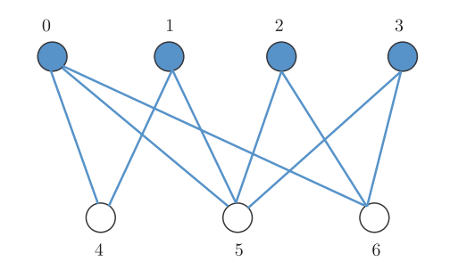

# 第5章 量子计算前沿话题

> 5.1 利用QPanda测试量子系统噪声
>
> 5.2 量子机器学习
>
> 5.3 使用单振幅和部分振幅量子虚拟机
>
> 5.4 将量子程序编译到不同的量子芯片上


## 5.1 利用QPanda测试量子系统噪声

&emsp;&emsp;近些年来，量子计算机芯片包含的量子比特数和量子比特质量不断提升，可以预计，不远的将来会出现包含数百个量子比特，且量子比特质量足够高的量子计算机芯片，称之为NISQ装置。如何用NISQ装置解决具体的实际问题是一个研究热点，比如VQE,QAOA都是有应用前景的NISQ量子算法。NISQ装置中量子比特数还不允许纠错编码，所以NISQ装置是一种噪声容忍装置，在NISQ装置中运行的量子算法都会受到噪声的影响。NISQ量子算法需要对量子噪声有一定的免疫性，需要在含噪声的环境中研究NISQ量子算法。QPanda中包含噪声量子虚拟机，可以模拟带噪声的量子线路，测试量子算法在噪声影响下的性能变化，从而辅助NISQ量子算法的开发。首先对量子噪声做一简单介绍。

### 5.1.1  量子噪声

量子计算机不是一个孤立系统，在运行的时候，不可避免会和环境产生耦合，从而影响量子计算机的运行过程，通常用噪声来描述环境对量子计算机的影响。 量子系统的噪声可以用一组算符和 $$\mathrm{K}=\left\{\mathrm{K}_{1}, \mathrm{~K}_{2}, \ldots, \mathrm{K}_{\mathrm{s}}\right\}$$ 描述： $$\left\{\mathrm{K}_{1}, \mathrm{~K}_{2}, \ldots, \mathrm{K}_{\mathrm{s}}\right\}$$ 也被称为Kraus算子， $$\mathrm{K}_{\mathrm{i}}$$ 需要满足关系式

$$
\sum_{\mathbf{i}} K_{i}^{\dagger} K_{i}=I
$$


&emsp;&emsp;在噪声影响下，量子态的演化方式为:

$$
\rho \rightarrow \sum_{\mathrm{i}} K_{i} \rho K_{i}^{\dagger}
$$


&emsp;&emsp;下面列举一些常见噪声的表示形式：

&emsp;&emsp;弛豫噪声:

$$
\mathrm{K}_{1}=\left[\begin{array}{cc}
1 & 0 \\
0 & \sqrt{1-p}
\end{array}\right], \mathrm{K}_{2}=\left[\begin{array}{cc}
0 & \sqrt{p} \\
0 & 0
\end{array}\right]
$$

&emsp;&emsp;比特翻转噪声:

$$
\mathrm{K}_{1}=\left[\begin{array}{cc}
\sqrt{1-p} & 0 \\
0 & \sqrt{1-p}
\end{array}\right], \mathrm{K}_{2}=\left[\begin{array}{cc}
0 & \sqrt{p} \\
\sqrt{p} & 0
\end{array}\right]
$$


&emsp;&emsp;退相位噪声:

$$
\mathrm{K}_{1}=\left[\begin{array}{cc}
\sqrt{1-p} & 0 \\
0 & \sqrt{1-p}
\end{array}\right], \mathrm{K}_{2}=\left[\begin{array}{cc}
\sqrt{p} & 0 \\
0 & -\sqrt{p}
\end{array}\right]
$$


&emsp;&emsp;退极化噪声:

$$
\begin{aligned}
&\mathrm{K}_{1}=\sqrt{1-\frac{3}{4} p}\left[\begin{array}{ll}
1 & 0 \\
0 & 1
\end{array}\right], \mathrm{K}_{2}=\frac{\sqrt{p}}{2}\left[\begin{array}{ll}
0 & 1 \\
1 & 0
\end{array}\right] \\
&\mathrm{K}_{3}=\frac{\sqrt{p}}{2}\left[\begin{array}{cc}
0 & -i \\
-i & 0
\end{array}\right], \mathrm{K}_{2}=\frac{\sqrt{p}}{2}\left[\begin{array}{cc}
1 & 0 \\
0 & -1
\end{array}\right]
\end{aligned}
$$

### 5.1.2 噪声虚拟机

&emsp;&emsp;QPanda包含带噪声的量子虚拟机，噪声量子虚拟机可以模拟带噪声的量子线路，我们可以定义各种不同的量子噪声，用噪声量子虚拟机执行对应的含噪声量子线 路。下面介绍QPanda中量子噪声虚拟机的执行原理。
加入噪声后，量子线路中演化的量子态变成混态，所以需要用密度矩阵来描述量子态。与纯态相比，模拟混态演化需要更多的资源，不管是时间复杂度还是空间复杂度，都是纯态演化所需资源的平方量级。为节省资源，在QPanda中，用另外一种方式实现了噪声量子虚拟机，即借助蒙特卡洛方法， 演化过程中还是用态矢来 描述量子态。下面以实现一个噪声量子逻辑门的过程来说明QPandan噪声量子虚拟机的实现原理。

&emsp;&emsp;首先，假设输入态是一个纯态, 用 $$|\phi\rangle$$ 表示，要实现的量子逻辑门用 $$\mathrm{U}$$ 表示，量子噪声为 $$\mathrm{K}=\{\mathrm{K}_{1}$$,$$ \mathrm{~K}_{2}$$,$$ \ldots$$,$$ \mathrm{K}_{\mathrm{s}}\}$$ 。含噪声的 $$\mathrm{U}$$ 门实现步骤如下: 计算 $$\mathrm{p}_{\mathrm{i}}=\left\langle\phi\left|K_{i}^{\dagger} K_{i}\right| \phi\right\rangle$$,$$ \mathrm{i}=1$$,$$2$$,$$ \ldots$$,$$ \mathrm{s} \cdot$$ 由噪声的定义，我们可以得到 $$\sum_{\mathrm{i}} p_{i}=1$$ 。
生成 $$[0$$,$$1)$$ 区间均匀分布的随机数 $$\mathrm{r}$$ ， 根据上式的计算结果找到下标 $$l$$ 满足

$$
\sum_{i=1}^{l-1} p_{i} \leq r \leq \sum_{i=1}^{l} p_{i}
$$


&emsp;&emsp;假设 $$\sum_{i=1}^{0} p_{i}=0$$ 。
&emsp;&emsp;$$|\phi\rangle$$ 的演化公式表示为:

$$
|\phi\rangle \rightarrow \mathrm{U} \frac{1}{\sqrt{\mathrm{P}_{1}}} K_{l}|\phi\rangle
$$


&emsp;&emsp;当以上操作只执行一次时，得到的结果是错误的，但是，当执行以上步骤多次，然后对得到的执行结果做统计分析，就可以得到准确的输出态，假设执行了 $$\mathrm{N}$$ 次， 得到了 $$\mathrm{N}$$ 个输出态 $$\left|\phi_{1}\right\rangle,\left|\phi_{2}\right\rangle, \ldots ,\left|\phi_{N}\right\rangle$$, 那么最后的输出态可以表示为:

$$
\rho^{\prime}=\frac{1}{\mathrm{~N}} \sum_{n=1}^{N}\left|\phi_{i}\right\rangle\left\langle\phi_{i}\right|
$$


​		$$\mathrm{N}$$ 个输出态 $$\left|\phi_{1}\right\rangle,\left|\phi_{2}\right\rangle, \ldots\left|\phi_{N}\right\rangle$$ 在集合 $$\left\{\left|\psi_{\mathrm{i}}\right\rangle=\mathrm{U} \frac{1}{\sqrt{\mathrm{P_i}}} K_{i}|\phi\rangle \mid \mathrm{i}=1,2, \ldots, \mathrm{s}\right\}$$ ，假设 $$\mathrm{N}$$ 个态中 $$\left|\psi_{\mathrm{i}}\right\rangle$$ 出现的次数为 $$\mathrm{M}_{\mathrm{i}}$$ ，那么 $$\rho^{\prime}$$ 可表示为

$$
\rho^{\prime}=\frac{1}{\mathrm{~N}} \sum_{n=1}^{s} \frac{M_{n}}{p_{n}} U K_{n}|\phi\rangle\langle\phi| K_{n}^{\dagger} U^{\dagger}
$$


&emsp;&emsp;当 $$\mathrm{N} \gg 1$$ 时， $$\mathrm{M}_{\mathrm{i}} \cong \mathrm{N} p_{i}$$, 从而可以得到

$$
\rho^{\prime} \cong \sum_{n=1}^{s} U K_{n}|\phi\rangle\langle\phi| K_{n}^{\dagger} U^{\dagger}=\rho_{\text {out }}
$$


&emsp;&emsp;即当 $$\mathrm{N}$$ 足够大时， $$\rho^{\prime}$$ 近似等于 $$|\phi\rangle$$ 经过噪声量子逻辑门 $$\mathrm{U}$$ 后的输出态 $$\rho$$ 。

&emsp;&emsp;当执行噪声量子线路时，量子线路由一系列量子逻辑门构成, 每个量子逻辑门都执行上面的步骤，执行多次量子线路，即可得到输出量子态密度矩阵的近似表达式，量子线路执行次数越多，得到的结果越准确。

&emsp;&emsp;通过上述方法， QPanda中噪声量子虚拟机就可以用态矢来表示混态演化过程，通过多次运行量子线路得到噪声量子线路输出态的密度矩阵。

**1.噪声QAOA测试**

&emsp;&emsp;前面的章节已经介绍过QAOA，QAOA是一种经典-量子混合算法，提供了一种解决组合优化问题的方法。QAOA运行在NISQ装置上，无法避免噪声的干扰，所以研究噪声对QAOA性能的影响是一项很重要的工作。下面介绍噪声对QAOA性能影响的一些研究进展。

&emsp;&emsp;首先，如何构建含噪声的QAOA，前面章节可知QAOA可以用VQNet实现，目前VQNet可以和QPanda中噪声量子虚拟机结合，执行含噪声的QAOA。这里选取的问题还是最大分割问题。

**2.理论模型**

&emsp;&emsp;考虑一种特殊的噪声，可以表示为$$\mathrm{K}=\left\{\mathrm{a}_{0} \mathrm{I}, \mathrm{a}_{1} \mathrm{~K}_{1}, \ldots, \mathrm{a}_{\mathrm{s}} \mathrm{K}_{\mathrm{s}}\right\}$$，即 $$\mathrm{K}$$ 的Kraus算子中一项是单位阵乘以常数$$a_0$$，这里$$\mathrm{a}_{i}, i=0,1, \ldots, s$$都是非负实数，比如，比特翻转噪声，退相位噪声，退极化噪声都属于这种类型的噪声。

**3.噪声对损失函数的影响**

&emsp;&emsp;假设输入态是一个纯态 $$\left|\phi_{\text {in }}\right\rangle$$ ，经过一个带噪声 $${K}$$ 的量子逻辑门 $$\mathrm{U}$$ 后，输出态 $$\rho_{\text {out }}$$ 可以写为：

$$
\rho_{\text {out }}^{\text {noise }}= (1-p) U |\phi_{\text {in }}\rangle\ \langle\phi_{\text {in }}| \ U^{\dagger}+\sum_{i} U K_{i}|\phi_{\text {in }}\rangle\langle\phi_{\text {in }}|\ K_{i}^{\dagger} U^{\dagger}
$$


&emsp;&emsp;这里定义 $${1}-\mathrm{p}=\mathrm{a}_{0}^{2}$$​ ， 不带噪声时，理想的输出态是 $$\rho_{\text {uut }}^{\text {ideal }}=U\left|\phi_{\text {in }}\right\rangle\left\langle\phi_{\text {in }}\right| U^{\dagger}$$​, 所以 $$\rho_{\text {out }}^{\text {noise }}$$​ 可进一步表示为

$$
\rho_{\text {out }}^{\text {noise }}=(1-p)  { \rho }^{\text {ideal }}+\sum_{i} U K_{i}\left|\phi_{\text {in }}\right\rangle\left\langle\phi_{\text {in }}\right| K_{i}^{\dagger} U^{\dagger}
$$


&emsp;&emsp;可以看到，在 $$\rho_{\text {out }}^{\text {noise }}$$ 中， $$\rho_{\text {out }}^{\text {ideal }}$$ 所占的比例是 $$1-\mathrm{p}$$ 。更进一步的考虑，如果经过一个包含 $$\mathrm{m}$$ 个量子逻辑门的量子线路，带噪声的输出态$$ \rho_{\text {out }}^{\text {noise }}$$与理想输出态 $$\rho_{\text {out }}^{\text {ideal }}$$ 的关系为

$$
\rho_{\text {out }}^{\text {noise }}=(1-\mathrm{p})^{m} \rho_{\text {out }}^{\text {ideal }}
$$


&emsp;&emsp;特别的，比例因子 $$\mathrm{P}=(1-\mathrm{p})^{m}$$ 是最坏的情况，对某些特殊的量子态，并不会受到某种噪声的影响，比特 $$|\phi\rangle=|0\rangle$$ 不会受到退相位噪声的影响，所以带噪声的输出态 $$\rho_{\text {out }}^{\text {noise }}$$ 与理想输出态 $$\rho_{\text {out }}^{\text {ideal }}$$ 的关系重新写为

$$
\rho_{\text {out }}^{\text {noise }}=(1-p)^{\alpha m} \rho_{\text {out }}^{\text {ideal }}
$$


$$\alpha$$表示一个常数，与量子线路结构和噪声模型相关。

​	下面开始介绍噪声对QAOA量子线路的影响。在QAOA中，QAOA步数$$n$$与QAOA量子线路包含的量子逻辑门数目线性相关，对一个步数为$$n$$的QAOA量子线路$$\mathrm{U}(\vec{\gamma}, \vec{\beta})$$, 如果没有噪声，经过 $$\mathrm{U}(\vec{\gamma}, \vec{\beta})$$ 后， 输出态为


$$
\left|\phi_{\text {out }}^{\text {ideal }}\right\rangle=\mathrm{U}(\vec{\gamma}, \vec{\beta})\left|\phi_{\text {in }}\right\rangle
$$


&emsp;&emsp;QAOA中，损失函数定义为目标哈密顿量 $$\mathrm{H}_{\mathrm{p}}$$ 的期望，在理想情况下，损失函数可表示为

$$
f^{\text {ideal }}(n)=\left\langle\phi_{\text {out }}^{\text {ideal }}\left|H_{p}\right| \phi_{\text {out }}^{\text {ideal }}\right\rangle
$$


​		当 QAOA 量子线路包含噪声 $$N$$ 时，输出态为

$$
\rho_{\text {out }}^{\text {noise }}=(1-p)^{\alpha m}\left|\phi_{\text {out }}^{\text {ideal }}\right\rangle\langle\phi_{\text {out }}^{\text {ideal }}|+\sum_{i} p_{i}| \psi_{i}\rangle\left\langle\psi_{i}\right|
$$


​		$$\left|\psi_{\mathrm{i}}\right\rangle$$ 是由噪声产生的，每个 $$\left|\psi_{\mathrm{i}}\right\rangle$$ 无规律的，另外在实际中，每个 $$\mathrm{p}_{\mathrm{i}}$$ 都会很小，满足：

$$
\sum_{i} p_{i}=1-(1-p)^{\alpha n}
$$


&emsp;&emsp;当量子线路比较复杂时， $$\left|\psi_{\mathrm{i}}\right\rangle$$​ 个数会很多，求和项 $$\sum_{i} p_{i}\left|\psi_{i}\right\rangle\left\langle\psi_{i}\right|$$​ 会趋于一个统计平均值。比如，在最大分割问题中，一种有 $$2^{\mathrm{n}}$$​ 种方案，每条边 $$\mathrm{C}_{\mathrm{ij}}$$​ 会出现 $$2^{\mathrm{n}}$$​ 次， 所以所有方案的平均结果为 $$\mathrm{A}=-\sum_{\mathrm{i}, \mathrm{j}} \frac{c_{i j}}{2}$$​, 从而 $$\sum_{i} p_{i}\left|\psi_{i}\right\rangle\left\langle\psi_{i}\right|$$​ 的统计平均值为 $$\left(1-(1-p)^{\alpha n}\right) \mathrm{A}$$​ ， 从而带噪声的情况下， QAOA 损失函数可以写为：

$$
f^{\text {noise }}(n)=(1-p)^{a n} f^{\text {ideal }}(n)+\left(1-(1-p)^{a n}\right) \mathrm{A}
$$

当 $$\mathrm{np}$$​ 足够小时， $$f^{\text {noise }}(n)$$​ 可以近似为

$$
f^{\text {noise }}(n) \cong(1-\alpha n p) f^{\text {ideal }}(n)+\alpha n p A
$$


&emsp;&emsp;从上面的式子，可以发现，噪声并没有改变 QAOA 参数空间的整体形状，只是将参数空间磨平，比例因子为 $$(1-p)^{\alpha n}$$

&emsp;&emsp;近些年来，量子计算机芯片包含的量子比特数和量子比特质量不断提升，可以预计，不远的将来会出现包含数百个量子比特，且量子比特质量足够高的量子计算机芯片，称之为NISQ装置。如何用NISQ装置解决具体的实际问题是一个研究热点，比如VQE,QAOA都是有应用前景的NISQ量子算法。NISQ装置中量子比特数还不允许纠错编码，所以NISQ装置是一种噪声容忍装置，在NISQ装置中运行的量子算法都会受到噪声的影响。NISQ量子算法需要对量子噪声有一定的免疫性，需要在含噪声的环境中研究NISQ量子算法。QPanda中包含噪声量子虚拟机，可以模拟带噪声的量子线路，测试量子算法在噪声影响下的性能变化，从而辅助NISQ量子算法的开发。首先对量子噪声做一简单介绍。

**4.噪声对损失函数梯度的影响**

&emsp;&emsp;QAOA是一种经典-量子混合算法，其中参数优化过程是一个经典过程。我可以用典型的经典算法来优化QAOA量子线路的参数，比如Nelder-Mead算法，Powell算 法， Adagrad算法等。当使用梯度相关的优化算法时，需要计算损失函数的梯度。量子噪声对损失函数有影响，所以也会对损失函数的梯度产生影响。下面描述量 子噪声对损失函数的梯度 会有怎样的影响。

&emsp;&emsp;QAOA量子线路包含两种参数： $$\vec{\gamma}$$ 和 $$\vec{\beta}$$ ，分别表示问题哈密顿量 $$\mathrm{H}_{\mathrm{p}}$$ 和驱动哈密顿量 $$\mathrm{H}_{\mathrm{d}}$$ 的系数， QAOA 步数为 $$\mathrm{n}$$ 时， $$\vec{\gamma}$$ 和 $$\vec{\beta}$$ 都是 $$\mathrm{n}$$ 维向量。 VQNet中损失函数对 $$\vec{\gamma}$$ 和 $$\vec{\beta}$$ 的偏导如下式所示


$$
\begin{aligned}
&\frac{\partial f(\vec{\gamma}, \vec{\beta})}{\partial \gamma_{k}}=\sum_{i, j}-2 C_{i j} \frac{f(\vec{\gamma}, \vec{\beta})_{k i j}^{+}-f(\vec{\gamma}, \vec{\beta})_{k i j}^{-}}{2} \\
&\frac{\partial f(\vec{\gamma}, \vec{\beta})}{\partial \beta_{k}}=\sum_{i=1}^{\ell}-2 \frac{f(\vec{\gamma}, \vec{\beta})_{k i}^{+}-f(\vec{\gamma}, \vec{\beta})_{k i}^{-}}{2}
\end{aligned}
$$


&emsp;&emsp;第一个式子中 $$f(\vec{\gamma}, \vec{\beta})_{k i j}^{+}$$表示将 Q A O A 量子线路中与边 $$C_{\mathrm{ij}}$$ 关联的参数 $$\gamma_{\mathrm{k}}$$ 改变为 $$\gamma_{\mathrm{k}}+\frac{\pi}{2}$$, 别的参数不变, 然后运行量子线路得到的损失函数， $$f(\vec{\gamma}, \vec{\beta}){k i j}^{-}$$表示将对应 位置的参数 $$\gamma{\mathrm{k}}$$ 改变为 $$\gamma{\mathrm{k}}-\frac{\pi}{2}$$ ，别的参数不变，然后运行量子线路得到的损失函数。同理，在第二个式子中， $$f(\vec{\gamma}, \vec{\beta})_{k i}^{+}$$和 $$f(\vec{\gamma}, \vec{\beta})_{k i}^{-}$$分别表示将第 $$\mathrm{i}$$ 个比特上面包含 $$\beta_{\mathrm{k}}$$ 的量子逻辑门的参数 $$\gamma_{k}$$ 改变为 $$\gamma_{k}+\frac{\pi}{2}$$ 和 $$\gamma_{k}-\frac{\pi}{2}$$ ，别的参数不变，运行量子线路得到的损失函数。具体的公式推导可从VQNet文献中得到。

&emsp;&emsp;从上面两个公式，可以看出损失函数的梯度是一系列量子线路参数不同的损失函数的线性组合，从量子噪声对损失函数的影响公式中，可以推出量子噪声对损失函 数梯度的影响如下式所示:

$$
\frac{\partial f(\vec{\gamma}, \vec{\beta})^{\text {noise }}}{\partial \theta_{k}}=(1-p)^{\alpha n} \frac{\partial f(\vec{\gamma}, \vec{\beta})^{\text {ideal }}}{\partial \theta_{k}}
$$


$$\theta_{\mathrm{k}} \in\{\vec{\gamma}, \vec{\beta}\}$$ ，可以看出，包含噪声的QAOA量子线路得到的损失函数对线路参数 $$\theta_{\mathrm{k}}$$ 的偏导与理想情况下损失函数对线路参数 $$\theta_{k}$$ 的偏导之间成比例，比例因子为 $$(1-p)^{a n}$$。

&emsp;&emsp;随着噪声参数变大，损失函数对参数偏导的绝对值变小, 换句话说，损失函数梯度的绝对值随噪声参数和QAOA步数的增加而变小, 这从另外一个角度说明了噪声 会使QAOA参数空间变平。另一方面，可以看出噪声不会改变损失函数梯度的方向，所以噪声只会影响 QAOA参数优化过程的优化速度，并不会改变参数优化结果，理论上，当噪声参数 $$p$$ 与QAOA步数 $$n$$ 的乘积比较小时，噪声QAOA优化得到的量子线路参数与理想最优量子线路参数一致。

**1）测试示例**

​		用QPanda噪声虚拟机和VQNet构建QAOA，数模模拟几种噪声对QAOA的影响，来验证上一节提出的模型。

**2）最大分割问题选取**

​		选择最大分割问题作为测试问题，整个测试过程测试问题是固定的，最大分割问题对应的图如图5.1.1所示：

</img>

<div align = "center">图5.1.1 最大分割图</div>

**3）理想结果**

&emsp;&emsp;首先演示理想情况下QAOA对这个问题的执行结果，QAOA步数为$$n=1 \sim 4$$，得到的损失函数优化过程如图5.1.2所示：

</img>

<div align = "center">图5.1.2 理想QAOA损失函数优化过程</div>

从图5.1.2可以看出，理想情况下，随着QAOA步数的增加，QAOA的性能不断提升，QAOA步数与优化后损失函数的关系如图5.1.3所示：

</img>

<div align = "center">图5.1.3 QAOA性能与步数的关系</div>

**4）噪声对损失函数的影响**

&emsp;&emsp;首先，测试噪声对QAOA损失函数的影响，选取3中不同的噪声：退相位噪声，比特翻转噪声和退极化噪声。在前面的章节已经介绍过，这三种噪声都包含一个参数 $$\mathrm{p}$$ ，选取 $$\mathrm{p}$$ 的范围为 $$[0.0001,0.02]$$ ，很多NISQ装置中这些橾声的参数处于这个区间，另外更关注 $$\mathrm{p}$$ 比较小的区间，所以通过如下公式在区间 $$[0.0001,0.02]$$ 中取11个点:

$$
\mathrm{p}_{\mathrm{i}}=0.0001 * 200^{0.1 \times \mathrm{i}}, \mathrm{i}=0,1,2, \ldots, 10
$$


&emsp;&emsp;在接下来的测试中，对QAOA的损失函数简单做了变形， $$Q A O A$$​ 损失函数是问题哈密顿量 $$\mathrm{H}_{\mathrm{p}}$$​ 的期望，前面的章节已经介绍过，对最大分割问题， $$\mathrm{H}_{\mathrm{p}}$$​ 可表示为 

$$
\mathrm{H}_{\mathrm{p}}=-\sum_{i, j} C_{i j} \frac{1-Z_{i} Z_{j}}{2}
$$


为便于分析，丟弃 $$\mathrm{H}_{\mathrm{p}}$$​ 中的常数项，并将其变为原来的两倍，这种变化不会对 $$\mathrm{QAOA}$$​ 的执行产生影响，变换后的 $$\mathrm{H}_{\mathrm{p}}^{\prime}$$​ 可表示为

$$
\mathrm{H}_{\mathrm{p}}^{\prime}=\sum_{i, j} C_{i j} Z_{i} Z_{j}
$$


&emsp;&emsp;则损失函数为: $$\mathrm{f}(\vec{\gamma}$$,$$ \vec{\beta})=\left\langle\mathrm{H}_{\mathrm{p}}^{\prime}\right\rangle$$ 。

在测试过程中，固定QAOA量子线路的参数，测试损失函数与噪声参数的关系，具体测试结果如图5.1.4所示：

</img>

<div align = "center">(a)退相位噪声</div>

</img>

<div align = "center">(b)比特翻转噪声</div>

</img>

<div align = "center">(c)退极化噪声</div>

<div align = "center">图 5.1.4 不同步数下噪声参数与损失函数关系曲线</div>


​		定义 $$\mathrm{y}=\frac{\mathrm{f}(\vec{\gamma} \vec{\beta})^{\text {noise }}}{\mathrm{f}(\vec{\gamma} \vec{\beta})^{\text {ideal }}}$$, 根据理论模型可得到 $$\mathrm{y}$$ 与噪声参数 $$\mathrm{p}$$ 及 $$\mathrm{QAOA}$$ 步数 $$\mathrm{n}$$ 的关系可表示为

$$
\mathrm{y}=(1-\mathrm{p})^{\alpha \mathrm{n}}
$$


​		用上面的公式对实验数据进行拟合，可以得到3种噪声对应的 3 个常数 $$\alpha$$ ；

$$
\begin{aligned}
&\alpha_{\text {dephasing }}=16.051 \\
&\alpha_{\text {bitflip }}=16.247 \\
&\alpha_{\text {depolarizing }}=18.846
\end{aligned}
$$

$$\alpha$$ 越大，说明对应噪声对 $$Q A O A$$ 影响越大，可以看出退极化噪声对 $$Q A O A$$ 影响最大。
		下面考虑噪声参数 $$\mathrm{p}$$ 和 $$\mathrm{QAOA}$$ 步数 $$\mathrm{n}$$ 比较小的实验数据，选取满足 $$\mathrm{np}<0.02$$ 的实验数据，当 $$\mathrm{np}$$ 比较小时， $$\mathrm{y} \cong 1-\alpha \mathrm{np}$$ ，令 $$\mathrm{x}=\mathrm{np}$$ ，得到 $$\mathrm{y}$$ 与 $$\mathrm{x}$$ 关系如图 $$5.1 .5$$ 所示，其中 " $$x$$ "点是实验数据，红线是斜率分别等于得到的3个拟合参数的直线，可以看出，当 $$\mathrm{np}$$ 比较小时，噪声损失函数与理想损失函数的比特因子 $$\mathrm{y}$$ 与 $$\mathrm{np}$$ 成线性关系。

</img>

<div align = "center">(a)退相位噪声</div>

</img>

<div align = "center">(b)比特翻转噪声</div>

</img>

<div align = "center">(c)退极化噪声</div>

​													图5.1.5 $$\mathrm{np}$$ 比较小的区间噪声对QAOA损失函数的影响

**5）噪声对损失函数梯度的影响**

&emsp;&emsp;现在测试噪声对损失函数梯度的影响，噪声对损失函数的影响公式为：

$$
\frac{\partial f(\vec{\gamma}, \vec{\beta})^{\text {noise }}}{\partial \theta_{k}}=(1-p)^{\alpha n} \frac{\partial f(\vec{\gamma}, \vec{\beta})^{\text {ideal }}}{\partial \theta_{k}}
$$


&emsp;&emsp;在这个测试中，固定$$QAOA$$量子线路的参数，测试损失函数对各参数的偏导与噪声参数的关系， $$\mathrm{QAOA}$$ 的步数 $$\mathrm{n}$$ 的区间还是 $$1 \sim 4 $$， 噪声参数 $$\mathrm{p}$$ 的选择方法与之前的 测试一致。为了减小统计误差，选取理想参数优化过程中梯度最大的量子线路参数序列作为测试参数。损失函数对各 $$\mathrm{QAOA}$$ 量子线路参数的偏导与噪声参数的关系 如图5.1.6所示，图中只包含 $$\mathrm{QAOA}$$ 步数 $$\mathrm{n}=4$$ 的情况， $$\mathrm{n}=1$$,$$2$$,$$3$$ 的情况与 $$\mathrm{n}=4$$ 的情况类似，所以没有列出。	

</img>

<div align = "center">(a)退相位噪声</div>

</img>

<div align = "center">(b)比特翻转噪声</div>

</img>

<div align = "center">(c)退极化噪声</div>

<div align = "center">图5.1.6 噪声对损失函数梯度的影响</div>


&emsp;&emsp;选取满足如下两个条件的数据: 一个条件还是 $$\mathrm{np}<0.02$$ ，另一个条件是 $$\left|\frac{\partial \mathrm{f}(\vec{\gamma} \vec{\beta})}{\partial \theta_{\mathrm{k}}}\right|>C, \theta_{k} \in\{\vec{\gamma}, \vec{\beta}\} \quad \mathrm{C}$$ 是一个常数，在这个测试中选择 $$\mathrm{C}=2.5$$ 。 定义

$$
\begin{aligned}
&\mathrm{y}=\frac{\partial \mathrm{f}{(\vec{\gamma}, \vec{\beta})^{noise}}}{\partial \theta_{\mathrm{k}}} / {\frac{\partial \mathrm{f}(\vec{\gamma}, \vec{\beta})^{\text {ideal }}}{\partial \theta_{\mathrm{k}}}} \\
&\mathrm{x}=\mathrm{np}
\end{aligned}
$$


&emsp;&emsp;可以得到

$$
y \cong 1-\alpha x
$$


&emsp;&emsp;将实验数据用上式拟合，拟合图像如图5.1.7所示，得到 3 个常数 $$\alpha$$ ：

$$
\alpha_{\text {dephasing }}=15.705, \alpha_{\text {bitflip }}=16.014, \alpha_{\text {depolarizing }}=17.213
$$

</img>

<div align = "center">(a)退相位噪声</div>

</img>

<div align = "center">(b)比特翻转噪声</div>

</img>

<div align = "center">(c)退极化噪声</div>

<div align = "center">图5.1.7 噪声对损失函数梯度的影响数据拟合图像</div>


**6）噪声对QAOA的影响**

&emsp;&emsp;接下来测试噪声对QAOA运行过程及运行结果的影响，在不同噪声及不同参数下运行QAOA，得到优化后的QAOA量子线路参数和损失函数。测试的噪声类型及噪声参数区间与之前的测试一致。测试数据如图5.1.8所示：

</img>

<div align = "center">(a)退相位噪声</div>

</img>

<div align = "center">(b)比特翻转噪声</div>

</img>

<div align = "center">(c)退极化噪声</div>

<div align = "center">图5.1.8 噪声与QAOA优化损失函数的关系</div>


&emsp;&emsp;首先，分析噪声参数对 $$Q A O A$$ 优化后的参数的影响，用欧式空间距离的均方根来描述两组参数的距离 $$\mathrm{d}$$ ， 用公式表示如下:

$$
\mathrm{d}=\sqrt{\frac{\left|\vec{\gamma}^{\text {noise }}-\vec{\gamma}^{\text {ideal }}\right|^{2}+\left|\vec{\beta}^{\text {noise }}-\vec{\beta}^{\text {ideal }}\right|^{2}}{2 n}}
$$


&emsp;&emsp;噪声参数与距离的测试数据如图5.1.9所示：

</img>

<div align = "center">图5.1.9. 噪声参数与距离的关系图
</div>

<div align = "center">(a)退相位噪声；(b)比特翻转噪声；(c)退极化噪声</div>


&emsp;&emsp;由此发现，当 $$\mathrm{np}$$ 比较小时，噪声 $$\mathrm{QAQA}$$ 优化后的参数与理想优化参数很接近，两组参数之间的距离主要来源于统计误差和优化算法的截止条件。前面已经得到噪 声会磨平$$\mathrm{QAQA}$$参数空间，所以含噪声的$$\mathrm{QAQA}$$损失函数娣度会比较小，梯度小的时候计算出来的梯度的相对误差会比较大，所以含噪声的$$\mathrm{OAOA}$$在优化到理想最 优参数附近时，参数优化方向的可靠性会降低，导致无法优化到最优参数。另外一方面，在测试中，设置优化截止条件为 $$\left|\frac{\ g r a d i e n t}{\mathrm{n}}\right|<\mathrm{C}$$，$$\mathrm{C}$$ 表示一个常数，取 $$\mathrm{C}=0.05$$ ，这也是噪声 $$\mathrm{QAQA}$$ 优化参数与理葙最优参数产生距离的一个原因。可以预计，当计算损失函数时，运行 $$\mathrm{QAQA}$$ 线路的次数 $$\mathrm{M} \rightarrow \infty$$ ，优化截止条件中的 $$\mathrm{C} \rightarrow 0$$ ， 当 $$\mathrm{np}$$ 比较小时，噪声 $$\mathrm{QAOA}$$ 优化后的参数与理想优化参数是一样的。


&emsp;&emsp;对满足 $$\mathrm{np}<0.02$$ 条件的实验数据进行拟合，与之前的测试一样，定义:


$$
\mathrm{y}=\frac{\mathrm{f}(\vec{\gamma}, \vec{\beta})^{\text {noise }}}{\mathrm{f}(\vec{\gamma}, \vec{\beta})^{i d e a l}}, \mathrm{x}=\mathrm{np}
$$


&emsp;&emsp;可以得到:

$$
y \cong 1-\alpha x
$$


&emsp;&emsp;用上面的公式对实验数据进行拟合，可以得到3种噪声对应的3个常数$$\alpha$$：

$$
\begin{aligned}
&\alpha_{\text {dephasing }}=24.133 \\
&\alpha_{\text {bitflip }}=24.245 \\
&\alpha_{\text {depolarizing }}=28.708
\end{aligned}
$$

&emsp;&emsp;拟合图像如图5.1.10所示，其中“x”点是实验数据，红线是斜率分别等于得到的3个拟合参数的直线，可以看出，当$$\mathrm{np}$$比较小时，噪声损失函数与理想损失函数的比特因子$$\mathrm{y}$$与$$\mathrm{np}$$成线性关系。

</img>

<div align = "center">(a)退相位噪声</div>

</img>

<div align = "center">(b)比特翻转噪声</div>

</img>

<div align = "center">(c)退极化噪声</div>

<div align = "center">图5.1.10 噪声对QAOA运行结果的影响数据拟合图像</div>


&emsp;&emsp;另一方面，发现这一节中得到的拟合常数 $$\alpha$$ 明显比前两节的拟合常数 $$\alpha$$ 大， 原因是噪声 $$Q A O A$$ 优化参数与理想QAOA优化参数之间存在距离，这个距离随着 $$\mathrm{np}$$ 的增 加而增加，导致 $$y$$ 值随着 $$\mathrm{np}$$ 变化的斜率更大，即 $$\alpha$$ 更大。

**总结**

&emsp;&emsp;在这节中，介绍了噪声对NISQ量子算法性能影响的研究进展，讨论了一种特殊的噪声对$$QAOA$$的影响，提出了噪声对 $$Q A O A$$ 影响的模型，并通过数值模拟验证了 模型的正确性，为 $$Q A O A$$ 在真实量子芯片上运行提供的参考。
这一研究领域还有很多开放性的问题，比如，本节介绍的方案只适用于一种噪声，即可以表示为 $$\mathrm{K}=\left\{\mathrm{a}_{0} \mathrm{I}, \mathrm{a}_{1} \mathrm{~K}_{1}, \mathrm{a}_{2} \mathrm{~K}_{2}, \ldots, \mathrm{a}_{s} \mathrm{~K}_{\mathrm{s}}\right\}$$ 的噪声，所以一种任意的噪声对 $$NISQ$$会有怎样的影响还是一个开放性的问题，另外噪声对别的NISQ算法的影响也是一个开放性的问题。
&emsp;&emsp;噪声对NISQ量子算法影响的研究是一个重要的研究方向，可以为 $$\mathrm{NISO}$$ 装置， $$NISQ$$量子算法提供借鉴作用，需要研究人员不断去探索新的进展。


## 5.2 量子机器学习

&emsp;&emsp;从《2001：太空漫游》中HAL9000的惊鸿一瞥，到大卫·杰洛德在《When HARLIE Was One》中对何为人类的探讨，再到近年《心理测量者》等对交由AI管理的反乌托邦社会的存在的合理性的思考，半个余世纪以来，伴随着计算机科学的飞速发展，人工智能成为了最引人注目的方向之一。这或许是千百年来人类“造物”畅想和现实最接近的一次。诸多科幻作品中描绘的足以撼动现代文明根基的新一代智慧生命的诞生可能离21世纪还很遥远，但如Siri、Cortana这般具备自我学习功能的程序已经深入到普通人的生活之中。

&emsp;&emsp;而机器学习正是实现人工智能的重要途径，其关注于通过经验自动改进的计算机算法的研究。换言之，我们期冀通过某些算法使计算机“学会”自行分析某一类数据中的规律，并利用获得的规律对未知数据进行预测。常见的机器学习算法可以分为监督学习、无监督学习和强化学习三类。监督学习从给定目标的训练集中学习得到某个函数，并通过函数对未知数据进行预测，本节着重讨论的分类器便是一例。无监督学习与监督学习相比，训练集不进行人为的目标标注，常见的有聚类算法。强化学习同样没有目标标注，而会对输入有着具有延时性的某种奖惩反馈，算法会随着环境的变动而逐步调整其行为，监督学习与无监督学习的数据之间是独立的，而强化学习存在前后依赖关系。Q-Learning是典型的强化学习算法。

&emsp;&emsp;如前文所言，量子计算机有着不容小觑的并行计算能力，而对于机器学习，强大的算力正是其需要的。这样，两者便有了结合的前提。本书其他章节介绍的变分本征求解器（VQE）、量子近似优化算法（QAOA算法）等便是其中的代表。包括上述在内的诸多目前被广泛讨论的量子机器学习算法都属于量子-经典混合算法的范畴。令量子计算机处理其擅长的部分，其余工作交给经典计算机，是一个较为现实的方案。

&emsp;&emsp;接下来以监督学习中的分类问题为例进行讨论。

&emsp;&emsp;鸢尾花数据集是机器学习中常用的数据集，由三种各50组鸢尾花样本构成。每个样本包含4个特征，分别为萼片(sepals)及花瓣(petals)的长和宽。我们要做的是从中抽取一部分样本对量子分类器进行训练，学习完成后，将剩余的样本用于分类测试，并期望预测的成功率尽可能高。

​		图5.2.1介绍了一种算法结构。

</img>

<div align = "center">图5.2.1  一种算法结构</div>


&emsp;&emsp;1、将经典的鸢尾花数据 $$X_{i}$$ 输入到某个带参数 $$\vec{\theta}$$ 的量子线路 $$Q C$$ 中，其中 $$\vec{\theta}$$ 的初始值为 $$\vec{\theta}$$  。  

&emsp;&emsp;2、经测量操作线路输出向量 $$\vec{a}$$ ，通过某个映射 $$g(\vec{a})$$得到对数据 $$X_{i}$$ 的分类预测 $$y_{i} $$  。

&emsp;&emsp;3、将分类预测 $$y_{i}$$ 与训练集中给定的真实分类结果 $$Y_{i}$$ 进行对比，并计算损失函数 $$f[y_{i}(\vec{\theta})$$,$$ Y_{i}]$$ 。  

&emsp;&emsp;4、返回第一步，将剩余的鸢尾花数据 $$X_{i^{'}}$$ 依次输入到线路 $$Q C$$ 中，得到对应的 $$f[y_{i}(\vec{\theta})$$,$$ Y_{i}^{\prime}]$$ ，并计算总代价函数 $$\sum_{i \in S e t} f[y_{i}(\vec{\theta})$$,$$ Y_{i}] / \mid Set \mid$$ 。  

&emsp;&emsp;5、利用经典计算机对代价函数进行最小化，重复更新线路中的参数 $$\theta_{j}(j=1$$,$$ \ldots$$,$$ n)$$ ，直到优化到截止条件 。  

&emsp;&emsp;这个算法的核心在于量子线路 $$Q C$$ 的设计，首先我们需要考虑如何将经典数据输入到 $$Q C$$ 中。常用的编码方式有两种，分别是编码到线路参数与编码到态振幅上。 对于本题而言，每个样本 $$X_{i}$$ 都有4个特征。如果采取第一种方式，我们可以将每个特征分别编码到一个量子比特的初态上。例如图5.2.2：

</img>

<div align = "center">图5.2.2 第一种编码方式</div>

&emsp;&emsp;如果采取第二种编码方式，希望得到量子态：

$$
\left|\varphi\left(X_{i}\right)\right\rangle=X_{i 0}|00\rangle+X_{i 1}|01\rangle+X_{i 2}|10\rangle+X_{i 3}|11\rangle
$$


&emsp;&emsp;显而易见，这种编码方式能更好地节约量子比特。但与此同时，它的制备过程也更加复杂，如图5.2.3： 

</img>

<div align = "center">图5.2.3 第二种编码方式</div>

&emsp;&emsp;其中

$$
\begin{aligned}
&\theta_{1}=2 \sin ^{-1}\left(\sqrt{X_{i 2}^{2}+X_{i 3}^{2}} / \sqrt{X_{i 0}^{2}+X_{i 1}{ }^{2}+X_{i 2}{ }^{2}+X_{i 3}{ }^{2}}\right) \\
&\theta_{2}=2 \sin ^{-1}\left(X_{i 1} / \sqrt{X_{i 0}^{2}+X_{i 1}^{2}}\right) \\ 
&\theta_{3}=2 \sin ^{-1}\left(X_{i 3} / \sqrt{X_{i 2}^{2}+X_{i 3}^{2}}\right)
\end{aligned}
$$


​		事实上，对于包含 $$m$$ 个特征的数据来说，采用第一种方案我们需要 $$0(m)$$ 个量子比特和 $$0(1)$$ 的线路深度，采用第二种方案我们需要 $$0(\log m)$$ 个量子比特和 $$O(m)$$ 的线路深度。

&emsp;&emsp;成功将经典数据编码到量子态后，需要考虑利用已有的量子比特或外加部分辅助比特设计量子线路。在设计线路时要尽快将量子比特纠缠起来。

</img>

<div align = "center">图5.2.4 一种较为常用的线路设计</div>

&emsp;&emsp;图5.2.4是一种较为常用的线路设计。我们知道，所谓的各种量子门，本质上都是对态进行酉变换。（注意：当引入辅助比特时，线路对总的量子态依然进行酉变换 操作，但对于待测量部分的变换末必是酉的。）所以，将经典数据 $$X_{i}$$ 编码到初态并利用含参数 $$\vec{\theta}$$ 的量子线路进行操作的全过程就是对 $$X_{i}$$ 进行了映射，只不过这种 映射与经典函数映射不同，发生在欧式空间与希尔伯特空间之间。但这种映射依然可以理解为一个形如 $$h_{\vec{\theta}}\left(X_{i}\right)$$ 的函数，与经典的机器学习类似。
		考虑将经典数据 $$X_{i}$$ 映射到量子态 $$\left|\psi\left(X_{i}\right)\right\rangle$$ 上，经过线路 $$U(\vec{\theta})$$ ，在 $${z}$$ 方向上进行测量，得到比特串$$\vec{\ a_{k}}$$的概率 
$$
p_{i k}=\langle\psi\left(X_{i}\right)|\ U^{\dagger}(\vec{\theta}) | a_{k}\rangle\langle a_{k}|U(\vec{\theta})| \psi\left(X_{i}\right)\rangle
$$

​		希望每次测量后与真实分类结果 $$Y_{i}$$ 对应的 $$\vec{\ a_{a(i)}}$$中的元素（换言之，任取 $$\vec{a} \in\left\{\vec{\ a_{a(i)}}\right\}$$ ，满足 $$Y_{i}=g(\vec{a})$$ )出现的概率尽可能大，这样才能更加准确地进行分类预测。虽然我们很难直接从量子线路中读取到相关的概率分布，但可以通过多次测量，利用 $$\vec{\ a_{k}}$$ 出现的频率 $$n_{k} / N$$ 对概率  $$p_{i k}$$ 进行估计。这样，待办事项转化为对线路重复测量，选取出现总频数 $$N_{j}=\sum_{\vec{\ a_{k}} \in\left\{\tilde{a_{j}}\right\}} n_{k}$$ 最高的比特串组 $$\left\{\vec {a_{j}}\right\}$$ ，得到与之对应的分类预测 $$y^{j}$$ ，记为 $$y_{i}$$。
​		显然，对尚末完成优化过程的分类器而言，其关于样本 $$X_{i}$$ 的分类预测 $$y_{i}$$ 并不能时常与真实的分类结果 $$Y_{i}$$ 对应。可以以如下方式构造损失函数（方法不唯一）：
$$
\text{Loss}(i)=f\left[y_{i}(\vec{\theta}), Y_{i}\right]=p\left(y_{i} \neq Y_{i}\right)
$$


设 $$Y_{i}=y^{\alpha(i)}$$ ，其余两类分别为 $$y^{\beta(i)}$$ 与 $$y^{\gamma(i)  \text { }}$$则

$$
\mathrm{p}\left(y_{i} \neq Y_{i}\right)=\mathrm{p}\left[N_{\alpha(i)}^{i}<\max \left(N_{\beta(i)}^{i}, N_{\gamma(i)}^{i}\right)\right]
$$


记

$$
N_{i}=N_{\alpha(i)}^{i}+N_{\beta(i)}^{i}+N_{\gamma(i)}^{i}=N_{\alpha(i)}^{i}+2 \max \left(N_{\beta(i)}^{i}, N_{\gamma(i)}^{i}\right)+\left|N_{\beta(i)}^{i}-N_{\gamma(i)}^{i}\right|
$$


有

$$
\begin{aligned}
&\mathrm{p}\left(y_{i} \neq Y_{i}\right)=p\left[N_{\alpha(i)}^{i}<\frac{N_{i}+\left|N_{\beta(i)}^{i}-N_{\gamma(i)}^{i}\right|}{3}\right]\\
                                                                                        &=\sum_{j=0}^\frac{N_{i}+\left|N_{\beta(i)}^{i}-N_{\gamma(i)}^{i}\right|}{3}\ C_{N_{i}}^{j} p_{i \alpha}{ }^{j}\left(1-p_{i \alpha}\right)^{N_{i}-j} \\
&\approx \int_{-\infty}^{\frac{N_{i}+\left|N_{\beta(i)}^{i}-N_{\gamma(i)}^{i}\right|}{3}} \frac{1}{\sqrt{2 \pi N_{i} p_{i \alpha}\left(1-p_{i \alpha}\right)}} e^{-\frac{\left(x-N_{i} p_{i \alpha}\right)^{2}}{2 N_{i} p_{i \alpha}\left(1-p_{i \alpha}\right)}} \mathrm{dx} \\
&=\frac{1}{2}+\frac{1}{2} \text{erf}\left[\frac{N_{i}+\left|N_{\beta(i)}^{i}-N_{\gamma(i)}^{i}\right|-3 N_{a(i)}^{i}}{3 \sqrt{2 N_{\alpha(i)}^{i}\left(1-N_{\alpha(i)}^{i} / N_{i}\right)}}\right]
\end{aligned}
$$


取一阶近似，

$$
\begin{aligned}
&p\left(y_{i} \neq Y_{i}\right) \approx \frac{1}{1+\exp \left[-\frac{4\left(N_{i}+\left|N_{\beta(i)}^{i}-N_{\gamma(i)}^{i}\right|-3 N_{\alpha(i)}^{i}\right)}{3 \sqrt{2 \pi N_{i c}\left(1-N_{\alpha(i)}^{i} / N_{i}\right)}}\right]} \\
&=S\left[\frac{4 \sqrt{2}}{3 \sqrt{\pi}} \sqrt{N_{i}} \frac{\max \left(\left\{N_{i}\right\} \backslash\left\{N_{\alpha(i)}^{i}\right\}\right)-N_{\alpha(i)}^{i}}{\sqrt{N_{\alpha(i)}^{i}\left(N_{i}-N_{\alpha(i)}^{i}\right)}}\right]
\end{aligned}
$$


其中

$$
S(x)=\frac{1}{1+e^{-x}}
$$

为 $$Sigmoid$$ 函数，常用于机器学习中。
计算总代价函数

$$
\begin{array}{r}
&\text { Cost }=\frac{1}{|\text{Set}|} \sum_{i \in S e t} S\left[\frac{4 \sqrt{2}}{3 \sqrt{\pi}} \sqrt{N_{i}} \frac{\max \left(\left\{N_{i}\right\} \backslash\left\{N_{a(i)}^{i}\right\}\right)-N_{\alpha(i)}^{i}}{\sqrt{N_{\alpha(i)}^{i}\left(N_{i}-N_{\alpha(i)}^{i}\right)}}\right] \\
&\approx \frac{1}{|S e t|} \sum_{i \in S e t} S\left[\sqrt{N_{i}} \frac{\max \left(\left\{N_{i}\right\} \backslash\left\{N_{\alpha(i)}^{i}\right\}\right)-N_{\alpha(i)}^{i}}{\sqrt{N_{\alpha(i)}^{i}\left(N_{i}-N_{\alpha(i)}^{i}\right)}}\right]
\end{array}
$$

&emsp;&emsp;其中 $$N_{i}$$ 为某一组参数 $$\vec{\theta} $$下 ，对样本 $$X_{i}$$ 输入到线路后，进行的有效的重复测量次数， $$N_{\alpha(i)}^{i}$$ 为测量得到 $$Y_{i}$$ 的次数，而 $$\mid Set\mid$$是数据集的大小。 总代价函数是参数 $$\vec{\theta}$$ 与数据集 $$\left\{X_{i}, Y_{i}\right\}$$ 的函数，利用经典计算机对其采取最小化并不断对参数进行更新，直到优化到截止条件。我们完成了对分类器的训练过程。 当我们需要对新的数据进行预测或测试时，利用参数优化到 $$\vec{\theta}$$ 的 $$Q C$$ 执行训。

</img>

<div align = "center">图5.2.5 分类器的训练过程</div>

练过程的前两步即可。

&emsp;&emsp;1.将待分类的鸢尾花数据 $$X_{i}$$ 输入到训练完成的量子线路 $$Q C$$ 中，其中 $$\vec{\theta}$$ 的值为 $$\vec{\theta^{'}}$$ 。
&emsp;&emsp;2.经测量操作线路输出向量 $$\vec{a}$$ ，通过映射 $$g$$ 得到对数据 $$X_{i}$$ 的分类预测 $$y_{i}$$ 。
&emsp;&emsp;实践出真知，让我们看看实际效果如何。

&emsp;&emsp;从数据集中随机挑选120组数据进行训练，采取第一类编码方式，利用本节介绍的线路设计方窣，线路深度为4层。优化方法为Powell法。比特串与分类预测的对 应关系如下：

&emsp;&emsp;1. $$0001$$、$$0010$$、$$0100$$、 $$1000 $$：山鸢尾

&emsp;&emsp;2. $$1110$$ 、 $$1101$$ 、 $$1011$$ 、$$ 0111$$ : 杂色鸢尾;

&emsp;&emsp;3. $$0011$$、$$0110$$、$$1100$$、$$1001$$：维吉尼亚鸢尾。

最终将代价函数优化到0.045，利用剩余30组数据进行测试。结果如图5.2.6。

></img>

<div align = "center">图5.2.6 结果</div>


&emsp;&emsp;可见，对于新数据的预测成功率保持在较高的水准，训练过程不存在过拟合的情况。不过同时我们也能看到，杂色鸢尾与维吉尼亚鸢尾之间似乎比其与山鸢尾之间更不易区分。这是否与我们分类器的设计有关？该问题就留待读者朋友自行思考了。（提示：请关注比特串与分类预测的对应关系。）

&emsp;&emsp;本节以机器学习中常见的鸢尾花数据集分类问题为例，介绍了量子分类器的基本模型。但如同经典分类算法一样，实际操作中可能需要考虑核函数构造等更加复杂的问题，囿于篇幅所限，不在这里一一赘述。如果您日后打算更加深入地探究相关问题，请务必牢记，尽管与经典函数有着诸多不同，但量子线路的作用依然是为数据提供了某种映射操作，这是量子分类器能够生效的核心原因。当您希望针对某一问题进行改进时，不妨关注线路映射的空间。

&emsp;&emsp;不止于此，乃至更广阔的量子机器学习迄今依然是一个值得进入的研究领域，一方面，诸如量子分类器、量子生成对抗网络等在内的有价值的算法还在不断涌现，另一方面，仍有许多像“复杂数据集如何映射”的有趣问题尚待解决。这个领域欢迎更多志同道合的朋友共同探索新的进展。

&emsp;&emsp;本节用到的鸢尾花分类器的Python代码示例：

```python
 1.from pyqpanda import *  
 2.from pyqpanda.Algorithm.hamiltonian_simulation import *
 3.from scipy.optimize import minimize
 4.import sklearn.datasets as datasets  
 5.import numpy as np  
 6.import math
 7.from functools import partial
 8.
 9.def initial_state(qubitlist, x):  
10.    qcir=QCircuit()  
11.    for qubit in qubitlist:
12.        qcir.insert(H(qubit))   
13.    qcir.insert(RZ(qubitlist[0], -2 * math.pi * (x[0] - 4.3) / 3.6)) \
14.        .insert(RZ(qubitlist[1], -2 * math.pi * (x[1] - 2) / 2.4)) \
15.        .insert(RZ(qubitlist[2], -2 * math.pi * (x[2] - 1) / 5.9)) \
16.        .insert(RZ(qubitlist[3], -2 * math.pi * (x[3] - 0.1) / 2.4))   
17.    return qcir  
18.      
19.def Uloc(qubitlist, theta_y, theta_z):  
20.    qcir=QCircuit()  
21.    for i in range(len(qubitlist)):  
22.        qcir.insert(RY(qubitlist[i], -theta_y[i])) \
23.            .insert(RZ(qubitlist[i], -theta_z[i]))   
24.    return qcir  
25.      
26.def Uent(qubitlist):  
27.    qcir=QCircuit()  
28.    for i in range(len(qubitlist) - 1):  
29.        qcir.insert(CZ(qubitlist[i], qubitlist[i + 1]))  
30.    qcir.insert(CZ(qubitlist[0], qubitlist[len(qubitlist) - 1]))  
31.    return qcir  
32.  
33.def Meas(result, y):    
34.    freq_y = 0  
35.    if y == 0:  
36.        for i in result:  
37.            if i == '0001' or i == '0010' or i == '0100' or i == '1000':  
38.                freq_y+=result[i]  
39.    if y == 1:  
40.        for i in result:  
41.            if i == '1110' or i == '1101' or i == '1011' or i == '0111':  
42.                freq_y+=result[i]  
43.    if y == 2:  
44.        for i in result:  
45.            if i == '0011' or i == '0110' or i == '1100' or i == '1001':  
46.                freq_y+=result[i]      
47.    return freq_y  
48.  
49.def loss(result, y, label_class):  
50.    freq_total = 0  
51.    freq = []  
52.    for i in range(label_class):  
53.        freq.append(Meas(result, i))  
54.        freq_total += Meas(result, i)  
55.    freq_without_y = list(freq)  
56.    del freq_without_y[y]  
57.    loss_value = 1 / (1 + math.exp(-(math.sqrt(freq_total) * (max(freq_without_y) - freq[y]) / math.sqrt((freq_total - freq[y]) * freq[y]))))  
58.    return loss_value  
59.  
60.def cost(theta, x, y, qubit_num, depth, label_class):  
61.    cost_value=0  
62.    theta_y = np.zeros((depth, qubit_num))  
63.    theta_z = np.zeros((depth, qubit_num))  
64.    for i in range(depth):  
65.        for j in range(qubit_num):  
66.            theta_y[i][j] = theta[2 * i * qubit_num + 2 * j]  
67.            theta_z[i][j] = theta[2 * i * qubit_num + 2 * j + 1]  
68.    for i in range(len(y)):
69.        init(QMachineType.CPU)
70.        qubitlist = qAlloc_many(qubit_num)  
71.        prog = QProg()  
72.        prog.insert(initial_state(qubitlist, x[i])) \
73.            .insert(Uloc(qubitlist, theta_y[0], theta_z[0]))  
74.        for j in range(1,depth):  
75.            prog.insert(Uent(qubitlist)) \
76.                .insert(Uloc(qubitlist, theta_y[j], theta_z[j]))  
77.        directly_run(prog)  
78.        result = quick_measure([qubitlist[0],qubitlist[1],qubitlist[2],qubitlist[3]], 2000)  
79.        cost_value += loss(result, y[i], label_class)  
80.        finalize()  
81.    cost_value /= len(y)  
82.    print(cost_value)  
83.    return cost_value  
84.  
85.def binding(x, y, qubit_num, depth, label_class):  
86.    return partial(cost, x=x, y=y, qubit_num=qubit_num, depth=depth, label_class=label_class)  
87.  
88.def test(theta, x, qubit_num, depth, label_class):  
89.    y_predict = []  
90.    theta_y = np.zeros((depth, qubit_num))  
91.    theta_z = np.zeros((depth, qubit_num))  
92.    for i in range(depth):  
93.        for j in range(qubit_num):  
94.            theta_y[i][j] = theta[2 * i * qubit_num + 2 * j]  
95.            theta_z[i][j] = theta[2 * i * qubit_num + 2 * j + 1]  
96.    for i in range(len(x)):  
97.        init(QMachineType.CPU)
98.        qubitlist = qAlloc_many(qubit_num)  
99.        prog = QProg()  
100.        prog.insert(initial_state(qubitlist,x[i])) \
101.            .insert(Uloc(qubitlist,theta_y[0],theta_z[0]))  
102.        for j in range(1,depth):  
103.            prog.insert(Uent(qubitlist)) \
104.                .insert(Uloc(qubitlist, theta_y[j], theta_z[j]))  
105.        directly_run(prog)  
106.        result = quick_measure([qubitlist[0],qubitlist[1],qubitlist[2],qubitlist[3]], 2000)  
107.        freq=[]  
108.        for j in range(label_class):  
109.            freq.append(Meas(result, j))  
110.        for j in range(label_class):  
111.            if freq[j] == max(freq):  
112.                y_predict.append(j)  
113.                break  
114.        finalize()  
115.    return y_predict  
116.  
117.def success_rate(predict_Y, test_Y):  
118.    success=0  
119.    fail=0  
120.    for i in range(len(predict_Y)):  
121.        if (predict_Y[i] == test_Y[i]):  
122.            success+=1  
123.        else:  
124.            fail+=1  
125.    return success,fail  
126.  
127.def data_shuffle_and_make_train_test(data, label, train_percentage = 0.8):  
128.    n_data = len(label)  
129.    permutation = np.random.permutation(range(n_data))  
130.    n_train = int(n_data * train_percentage)  
131.    n_test = n_data - n_train  
132.    train_permutation = permutation[0:n_train]  
133.    test_permutation = permutation[n_train:]  
134.    return data[train_permutation], label[train_permutation], data[test_permutation], label[test_permutation]  
135.  
136.qubit_num = 4  
137.depth = 4  
138.label_class=3  
139.data, label = datasets.load_iris(return_X_y=True)  
140.data, label, test_d , test_l = data_shuffle_and_make_train_test(data,label)  
141.theta = np.random.random_sample(2 * qubit_num * depth)  
142.result = minimize(binding(data, label, qubit_num, depth, label_class), theta, method = 'Powell')  
143.  
144.y_predict = []  
145.theta = result.x  
146.y_predict = test(theta, test_d, qubit_num, depth, label_class)  
147.success, fail = success_rate(y_predict, test_l)  
148.print(test_l)  
149.print(np.array(y_predict))  
150.print(success/(success+fail))  
```

### 5.3 使用单振幅和部分振幅量子虚拟机

### 5.3.1 单振幅量子虚拟机

&emsp;&emsp;目前可以通过量子计算的相关理论，用经典计算机实现模拟量子虚拟机。 量子虚拟机的模拟主要有全振幅与单振幅两种解决方案，其主要区别在于，全振幅一次模拟计算就能算出量子态的所有振幅，单振幅一次模拟计算只能计算出$$2^N$$ 个振幅中的一个。

&emsp;&emsp;然而全振幅模拟量子计算时间较长，计算量随量子比特数指数增长，在现有硬件下，无法模拟超过49量子比特。通过单振幅量子虚拟机技术可以模拟超过49比特，同时模拟速度有较大提升，且算法的计算量不随量子比特数指数提升。

**1.使用介绍**

&emsp;&emsp;QPanda2中设计了 SingleAmplitudeQVM 类用于运行单振幅模拟量子计算，同时提供了相关接口，它的使用也很简单。

&emsp;&emsp;首先构建一个单振幅量子虚拟机：

```
1.auto machine = new SingleAmplitudeQVM();  
```

&emsp;&emsp;然后必须使用 SingleAmplitudeQVM::init() 初始化量子虚拟机环境：

```
1.machine->init();  
```

&emsp;&emsp;接着进行量子程序的构建、装载工作：

```c++
1.auto prog = QProg();  
2.auto qlist = machine->qAllocMany(10);  
3.auto clist = machine->cAllocMany(10);  
4.  
5.for_each(qlist.begin(), qlist.end(), [&](Qubit *val) { prog << H(val); });  
6.prog << CZ(qlist[1], qlist[5]) << CZ(qlist[3], qlist[5]) << CZ(qlist[2], qlist[4]);  
7....  
8.machine->directlyRun(prog);  
```

&emsp;&emsp;最后调用计算接口，设计多种返回值的接口用于满足不同的计算需求，具体见示例所述：

**2.实例**

&emsp;&emsp;以下示例展示了单振幅量子虚拟机接口的使用方式

```c++
 1.#include "QPanda.h"
 2.USING_QPANDA  
 3.
 4.int main(void)
 5.{
 6.    auto machine  = new SingleAmplitudeQVM();
 7.    machine->init();
 8.
 9.    auto prog  = QProg();
10.    auto qlist = machine->qAllocMany(10);
11.    auto clist = machine->cAllocMany(10);
12.
13.    for_each(qlist.begin(), qlist.end(), [&](Qubit *val) { prog  << H(val); });
14.    prog  << CZ(qlist[1], qlist[5])
15.        << CZ(qlist[3], qlist[5])
16.        << CZ(qlist[2], qlist[4])
17.        << CZ(qlist[3], qlist[7])
18.        << CZ(qlist[0], qlist[4])
19.        << RY(qlist[7], PI  / 2)
20.        << RX(qlist[8], PI  / 2)
21.        << RX(qlist[9], PI  / 2)
22.        << CR(qlist[0], qlist[1], PI)
23.        << CR(qlist[2], qlist[3], PI)
24.        << RY(qlist[4], PI  / 2)
25.        << RZ(qlist[5], PI  / 4)
26.        << RX(qlist[6], PI  / 2)
27.        << RZ(qlist[7], PI  / 4)
28.        << CR(qlist[8], qlist[9], PI)
29.        << CR(qlist[1], qlist[2], PI)
30.        << RY(qlist[3], PI  / 2)
31.        << RX(qlist[4], PI  / 2)
32.        << RX(qlist[5], PI  / 2)
33.        << CR(qlist[9], qlist[1], PI)
34.        << RY(qlist[1], PI  / 2)
35.        << RY(qlist[2], PI  / 2)
36.        << RZ(qlist[3], PI  / 4)
37.        << CR(qlist[7], qlist[8], PI);
38.
39.    machine->directlyRun(prog);
40.    auto res = machine->getProbDict(qlist);
41.    cout << res["0000000000"] << endl;
42.    cout << res["0000000001"] << endl;
43.    delete(machine);
44.    return 0;
45.}
```

​	&emsp;·getProbDict()接口表示输出计算后的量子态概率，输出结果用map容器保存，key为量子态对应的字符串，value为对应的概率，上述程序的计算结果如下：

```
1.0.00166709
2.0.00166709 
```

&emsp;&emsp;若使用其他接口：

&emsp;&emsp;· getProbDict(qvec,std::string) ,使用示例

```c++
1.QVec qvec;  
2.for_each(qlist.begin(), qlist.end(), [&](Qubit *val) { qvec.emplace_back(val); });  
3.machine->directlyRun(prog);
4.auto res = machine->getProbDict(qlist);
5.for (auto val : res)
6.{
7.std::cout << val.first << " : " << val.second << std::endl;
8.}  
```

&emsp;&emsp;结果输出如下：

```
1.0000000000 : 0.0016671
2.0000000001 : 0.0016671
3.0000000010 : 0.000286029
4.0000000011 : 0.000286029
5.0000000100 : 0.000286029
6.0000000101 : 0.000286029
7.......
```

​		· pMeasureBinindex(std::string) ,使用示例

```
1.auto res = machine->pMeasureBinindex("0000000001"); 
2.std::cout << res << std::endl;  
```

&emsp;&emsp;通过二进制形式下标测量指定振幅，结果输出如下：

```
1.(0.0408301,-7.80626e-18)
```

&emsp;&emsp;· pMeasureDecindex(std::string) ,使用示例

```
1.auto res = PMeasure_bin_index("1");  
2.std::cout << res << std::endl;  
```

&emsp;&emsp;通过十进制形式下标测量指定振幅，结果输出如下：

```
1.0.00166709  
```

### 5.3.2 部分振幅量子虚拟机

&emsp;&emsp;目前用经典计算机模拟量子虚拟机的主流解决方案有全振幅与单振幅两种。除此之外，还有部分振幅量子虚拟机，该方案能在更低的硬件条件下，实现更高的模拟效率。 部分振幅算法的基本思想是将大比特的量子计算线路图拆分成若干个小比特线路图，具体数量视线路扶持情况而定。

**1.使用介绍**

&emsp;&emsp;QPanda2中设计了 PartialAmplitudeQVM 类用于运行部分振幅模拟量子计算，同时提供了相关接口，它的使用很简单。

&emsp;&emsp;首先构建一个部分振幅量子虚拟机:

```
1.auto machine = new PartialAmplitudeQVM();  
```

&emsp;&emsp;然后必须使用 PartialAmplitudeQVM::init() 初始化量子虚拟机环境:

```
1.machine->init();  
```

&emsp;&emsp;接着进行量子程序的构建、装载工作:

```c++
1.auto prog = QProg();  
2.auto qlist = machine->qAllocMany(10);  
3.auto clist = machine->cAllocMany(10);  
4.  
5.for_each(qlist.begin(), qlist.end(), [&](Qubit *val) { prog << H(val); });  
6.prog << CZ(qlist[1], qlist[5]) << CZ(qlist[3], qlist[5]) << CZ(qlist[2], qlist[4]);  
7....  
8.machine->directlyRun(prog);  
```

&emsp;&emsp;最后调用计算接口，设计多种返回值的接口用于满足不同的计算需求，具体见示例所述：

**2.实例**

&emsp;&emsp;以下示例展示了部分振幅量子虚拟机接口的使用方式:

```c++
 1.#include "QPanda.h"  
 2.USING_QPANDA  
 3.  
 4.int main(void)  
 5.{  
 6.    auto machine = new PartialAmplitudeQVM();  
 7.    machine->init();  
 8.  
 9.    auto prog = QProg();  
10.    auto qlist = machine->qAllocMany(10);
11.    auto clist = machine->cAllocMany(10); 
12.  
13.    auto prog = QProg();  
14.    for_each(qlist.begin(), qlist.end(), [&](Qubit *val) { prog << H(val); });  
15.    prog << CZ(qlist[1], qlist[5])  
16.         << CZ(qlist[3], qlist[7])  
17.         << CZ(qlist[0], qlist[4])  
18.         << RZ(qlist[7], PI / 4)  
19.         << RX(qlist[5], PI / 4)  
20.         << RX(qlist[4], PI / 4)  
21.         << RY(qlist[3], PI / 4)  
22.         << CZ(qlist[2], qlist[6])  
23.         << RZ(qlist[3], PI / 4)  
24.         << RZ(qlist[8], PI / 4)  
25.         << CZ(qlist[9], qlist[5])  
26.         << RY(qlist[2], PI / 4)  
27.         << RZ(qlist[9], PI / 4)  
28.         << CR(qlist[2], qlist[7], PI / 2);  
29.  
30.    machine->directlyRun(prog);
31.    auto res = machine->getProbDict(qlist);
32.    cout << res["0000000000"] << endl;
33.    cout << res["0000000001"] << endl;
34.    delete(machine);
35.    return 0;
36.}
```

&emsp;&emsp;上述程序的计算结果如下:

```
1.0.0016671
2.0.0016671
```

&emsp;&emsp;若使用其他接口：

&emsp;&emsp;· PMeasure_bin_index(std::string) ,使用示例:

```c++
1.auto res = machine->PMeasure("6");  
2.for (auto val :res)  
3.{  
4.    std::cout << val.first << " : " << val.second << std::endl;  
5.}  
```

&emsp;&emsp;结果输出如下：

```
1.0.00166709 
```

&emsp;&emsp;· getProbDict(qvec,std::string) ,使用示例:

```c++
1.QVec qvec;  
2.for_each(qlist.begin(), qlist.end(), [&](Qubit *val) { qvec.emplace_back(val); });  
3.  
4.auto res = machine->getProbDict(qlist);
5.for (auto val : res)
6.{
7.    std::cout << val.first << " : " << val.second << std::endl;
8.} 
```

&emsp;&emsp;结果输出如下：

```
1.0000000000 : 0.0016671
2.0000000001 : 0.0016671
3.0000000010 : 0.000286029
4.0000000011 : 0.000286029
5.0000000100 : 0.000286029
6.0000000101 : 0.000286029 
```

&emsp;&emsp;· pmeasure_bin_indexstd::string) ,使用示例:

```
1.auto res = machine->pmeasure_bin_index("0000000001");
2.    std::cout << res << std::endl;  
```

&emsp;&emsp;通过二进制形式下标测量指定振幅，结果输出如下：

```
1.(0.0408301,-7.80626e-18)
```

&emsp;&emsp;· pmeasure_dec_index(std::string) ,使用示例:

```
1.auto res = machine->pmeasure_dec_index("6");
2.std::cout << res << std::endl;  
```

&emsp;&emsp;通过十进制形式下标测量指定振幅，结果输出如下：

```
1.(-4.33681e-18,-0.0408301)
```


## 5.4 将量子程序编译到不同的量子芯片上

&emsp;&emsp;任何的量子程序，最终是要放到量子计算机中去运行的。和量子虚拟机相比，在量子计算机中运行有几个重要的区别：

**1.支持的逻辑门**

&emsp;&emsp;量子芯片中往往不一定允许执行所有的酉变换，对于单比特门来说，通常只支持一个子集。由于这个定理: 任何的两个不同方向的旋转 $${U}_{\bar{x}}(\theta)=e^{i \vec{\sigma x} \theta}$$ 和 $$\mathrm{U}_{\bar{y}}(\theta)=e^{i \vec{\sigma} \bar{y} \theta}$$ ， 一定能通过依次施加不同角度的旋转操作，构成任何的单比特上的酉变换。因此，量子计算机中若支持两个方向的旋转操作， 即可实现任意的单门。

&emsp;&emsp;QPanda中提供了一个配置量子计算机中支持逻辑门的方式。通过配置，可以将任意的量子程序编译到支持的量子逻辑门中。

**2.量子芯片拓扑结构**

&emsp;&emsp;编写量子程序，或者设计量子算法时，往往在任意两个比特之间都有可能出现逻辑门的连接。然而，对于实际的量子芯片，有可能这种连接关系是受限的。例如量子比特在芯片上以网格式排列，只有最近邻（nearest neighbor）的量子比特之间才允许进行操作。那么，对于原有的量子程序，我们必须将所有不支持操作的量子逻辑门进行变换，或者对量子比特进行重新映射。

&emsp;&emsp;QPanda中提供了一个配置量子芯片拓扑结构的方式。

&emsp;&emsp; 指令集

&emsp;&emsp;量子指令集是由各公司定义的量子计算机控制指令集，它适配于量子软件开发包，一般可以用于直接控制该公司的量子计算机。QPanda中通用的量子程序表示方式是QProg类，它提供的是一种对量子程序的抽象通用表述形式。QPanda提供一系列函数，将QProg类映射到不同的量子指令集上，包括QRunes，QASM，Quil……

​		配置支持的逻辑门

```c++
 1.<QGate>  
 2.    <SingleGate>  
 3.        <Gate  time = "2">rx</Gate>  
 4.        <Gate  time = "2">Ry</Gate>  
 5.        <Gate  time = "2">RZ</Gate>  
 6.        <Gate  time = "2">S</Gate>  
 7.        <Gate  time = "2">H</Gate>  
 8.        <Gate  time = "2">X1</Gate>  
 9.     </SingleGate>  
10.     <DoubleGate>  
11.        <Gate  time = "5">CNOT</Gate>  
12.        <Gate  time = "5">CZ/Gate>  
13.        <Gate  time = "5">ISWAP</Gate>  
14.     </DoubleGate>  
15.</QGate>  
```

&emsp;&emsp;在QPanda中，指令集的配置是通过QPandaConfig.xml中QGate元素来配置的。

&emsp;&emsp;QGate中的元素介绍：

&emsp;&emsp;SingleGate: 单量子逻辑门配置，是QGate的子元素

&emsp;&emsp;DoubleGate: 双量子逻辑门配置， 是QGate的子元素

&emsp;&emsp;Gate: 内容配置支持的量子逻辑门，属性time配置量子逻辑门的时钟周期，是DoubleGate和SingleGate的子元素。

&emsp;&emsp;示例：一个量子芯片支持单门RX、RY和双门CNOT，RX、RY的时钟周期均为2，CNOT的时钟周期为5。下面我们就配置这个量子芯片支持的逻辑门。

&emsp;&emsp;首先，打开QPandaConfig.xml文件，找到QGate元素，可以看到QGate元素的子元素SingleGate和DoubleGate，并删除SingleGate和DoubleGate元素中所有的内容。

```c++
1.<QGate>  
2.        <SingleGate>  
3.</SingleGate>  
4.        <DoubleGate>  
5.        </DoubleGate>  
6. </QGate>  
```

&emsp;&emsp;然后，分别向SingleGate和DoubleGate 元素中添加Gate元素（Gate元素的内容为量子逻辑门，属性值time为逻辑门的时钟周期）。在SingleGate元素中添加两个Gate子元素，属性time均为2，内容分别为RX、RY。在DoubleGate元素中添加一个Gate子元素，属性time为5，内容为CNOT。

```
1.<QGate>  
2.        <SingleGate>  
3.        <Gate time = "2">RX</Gate>  
4.            <Gate time = "2">RY</Gate>  
5.</SingleGate>  
6.        <DoubleGate>  
7.            <Gate time = "5">CNOT</Gate>  
8.        </DoubleGate>  
9. </QGate>  
```

&emsp;&emsp;配置量子芯片拓扑结构

```c++
 1.<Metadata>  
 2.      <QubitCount>8</QubitCount>  
 3.          <QubitMatrix>  
 4.              <Qubit QubitNum = "1">  
 5.                  <AdjacentQubit QubitNum = "2">1</AdjacentQubit>  
 6.                  <AdjacentQubit QubitNum = "8">1</AdjacentQubit>  
 7.               </Qubit>  
 8.               <Qubit QubitNum = "2">  
 9.                  <AdjacentQubit QubitNum = "1">1</AdjacentQubit>  
10.                  <AdjacentQubit QubitNum = "3">1</AdjacentQubit>  
11.                  <AdjacentQubit QubitNum = "7">1</AdjacentQubit>  
12.                </Qubit>  
13.                <Qubit QubitNum = "3">  
14.                  <AdjacentQubit QubitNum = "2">1</AdjacentQubit>  
15.                  <AdjacentQubit QubitNum = "4">1</AdjacentQubit>  
16.                  <AdjacentQubit QubitNum = "6">1</AdjacentQubit>  
17.                </Qubit>  
18.                <Qubit QubitNum = "4">  
19.                  <AdjacentQubit QubitNum = "3">1</AdjacentQubit>  
20.                  <AdjacentQubit QubitNum = "5">1</AdjacentQubit>  
21.                </Qubit>  
22.                <Qubit QubitNum = "5">  
23.                  <AdjacentQubit QubitNum = "4">1</AdjacentQubit>  
24.                  <AdjacentQubit QubitNum = "6">1</AdjacentQubit>  
25.                </Qubit>  
26.                <Qubit QubitNum = "6">  
27.                  <AdjacentQubit QubitNum = "3">1</AdjacentQubit>  
28.                  <AdjacentQubit QubitNum = "5">1</AdjacentQubit>  
29.                  <AdjacentQubit QubitNum = "7">1</AdjacentQubit>  
30.                </Qubit>  
31.                <Qubit QubitNum = "7">  
32.                  <AdjacentQubit QubitNum = "2">1</AdjacentQubit>  
33.                  <AdjacentQubit QubitNum = "6">1</AdjacentQubit>  
34.                  <AdjacentQubit QubitNum = "8">1</AdjacentQubit>  
35.                </Qubit>  
36.                <Qubit QubitNum = "8">  
37.                  <AdjacentQubit QubitNum = "7">1</AdjacentQubit>  
38.                  <AdjacentQubit QubitNum = "1">1</AdjacentQubit>  
39.                </Qubit>  
40.          </QubitMatrix>  
41.</Metadata>  
```

&emsp;&emsp;在QPanda中，量子芯片拓扑结构是通过QPandaConfig.xml中Metadata元素来配置的。

**Metadata中的元素介绍：**

&emsp;&emsp;QubitCount：量子比特的个数，是metadata的子元素。

&emsp;&emsp;QubitMatrix：量子比特拓扑图，是metadata的子元素。

&emsp;&emsp;Qubit：量子比特配置，属性QubitNum表示量子比特序号，是QubitMatrix的子元素。

&emsp;&emsp;AdjacentQubit：内容是边的权重，属性QubitNum是指与其父元素Qubit连接的量子比特序号。

&emsp;&emsp;例如图5.4.1，将下面的量子拓扑结构配置到QPandaConfig.xml中，圆圈表示量子比特，圆圈里的值表示量子比特序号，线条表示是否连接，线条上数值的值表示权重。

></img>

<div align = "center">图5.4.1 将量子拓扑结构配置到QPandaConfig.xml中</div>

&emsp;&emsp;首先，找到Metadata元素，并删除其QubitMatrix中的所有内容：

```
1.<Metadata>  
2.    <QubitCount>8</QubitCount>  
3.<QubitMatrix>  
4.</QubitMatrix>  
5.</Metadata>  
```

&emsp;&emsp;然后， 根据拓扑图向QPandaConfig.xml中添加配置。先配置量子比特的个数。例子中的量子比特个数为4个

```
1.<Metadata>  
2.    <QubitCount>4</QubitCount>  
3.<QubitMatrix>  
4.</QubitMatrix>  
5.</Metadata>  
```

&emsp;&emsp;再配置拓扑结构，添加第一个量子比特的拓扑配置，在QubitMatrix下添加Qubit子元素，其属性QubitNum的值为1，第一个量子比特与第二个量子比特和第三个量子比特连接，其权重都是1，所以Qubit会有两个AdjacentQubit子元素，第一个AdjacentQubit元素的属性QubitNum的值是2，第二个AdjacentQubit元素的属性QubitNum的值是3，其内容都是1，将第一个量子比特的拓扑配置添加到配置中

```
1.<Metadata>  
2.    <QubitCount>4</QubitCount>  
3.<QubitMatrix>  
4.    <Qubit QubitNum = 1>  
5.        <AdjacentQubit QubitNum = 2>1</AdjacentQubit>  
6.        <AdjacentQubit QubitNum = 3>1</AdjacentQubit>  
7.</Qubit>  
8.</QubitMatrix>  
9.</Metadata>  
```

&emsp;&emsp;以此类推，将后面的几个量子比特拓扑结构添加到配置中

```
 1.<Metadata>  
 2.    <QubitCount>4</QubitCount>  
 3.<QubitMatrix>  
 4.     <Qubit QubitNum = 1>  
 5.        <AdjacentQubit QubitNum = 2>1</AdjacentQubit>  
 6.        <AdjacentQubit QubitNum = 3>1</AdjacentQubit>  
 7.</Qubit>  
 8.<Qubit QubitNum = 2>  
 9.        <AdjacentQubit QubitNum = 1>1</AdjacentQubit>  
10.        <AdjacentQubit QubitNum = 4>1</AdjacentQubit>  
11.</Qubit>  
12.<Qubit QubitNum = 3>  
13.        <AdjacentQubit QubitNum = 1>1</AdjacentQubit>  
14.        <AdjacentQubit QubitNum = 4>1</AdjacentQubit>  
15.</Qubit>  
16.<Qubit QubitNum = 4>  
17.        <AdjacentQubit QubitNum = 2>1</AdjacentQubit>  
18.        <AdjacentQubit QubitNum = 3>1</AdjacentQubit>  
19.</Qubit>  
20.</QubitMatrix>  
21.</Metadata>  
```

**转换到不同的指令集**

&emsp;&emsp;将量子程序编译到不同的量子芯片实际上就是可以将量子程序编译成的量子芯片对应的指令集，QPanda2当前支持将量子程序编译成QUIL指令集、IBM的QASM指令集、本源量子的QRunes指令集。

&emsp;&emsp;QUIL指令集是采用“指令+参数列表的设计方法”，一个简单的例子如下：

```
1.X 0  
2.Y 1  
3.CNOT 0 1  
4.H 0  
5.RX(-3.141593) 0  
6.MEASURE 1 [0]  
```

&emsp;&emsp;QASM具有C和汇编语言的元素，语句用分号分隔，忽略空格，同时语言是区分大小写的。注释以一对前斜线开始，并以新的行结束。一个简单的QASM指令集如下：

```
 1.OPENQASM 2.0;  
 2.include "qelib1.inc";  
 3.qreg q[10];  
 4.creg c[10];  
 5.  
 6.x q[0];  
 7.h q[1];  
 8.tdg q[2];  
 9.sdg q[2];  
10.cx q[0],q[2];  
11.cx q[1],q[4];  
12.u1(pi) q[0];  
13.u2(pi,pi) q[1];  
14.u3(pi,pi,pi) q[2];  
15.cz q[2],q[5];  
16.ccx q[3],q[4],q[6];  
17.cu3(pi,pi,pi) q[0],q[1];  
18.measure q[2] -> c[2];  
19.measure q[0] -> c[0];  
```

&emsp;&emsp;如何利用QPanda2将量子程序转化为想要的指令集呢？可以使用下面的方法，首先利用QPanda2构建一个量子程序：

```
1.QProg prog;  
2.auto qubits = qvm->qAllocMany(4);  
3.auto cbits  = qvm->cAllocMany(4);  
4.  
5.prog << X(qubits[0])  
6.    << Y(qubits[1])  
7.    << H(qubits[2])  
8.    << RX(qubits[3], 3.14)  
9.    << Measure(qubits[0], cbits[0]);  
```

&emsp;&emsp;然后调用QPanda2的工具接口，完成转换，比如转化为QUIL指令集可以调用下面的接口：

```
1.std::string instructions = convert_qprog_to_quil(prog, qvm);  
```

&emsp;&emsp;得到转化后的QUIL指令集：

```
1.X 0  
2.Y 1  
3.H 2  
4.RX(3.140000) 3  
5.MEASURE 0 [0]  
```

&emsp;&emsp;转化为QASM指令集与转化为QUIL指令集的方法类似，可以调用下面的接口：

```
1.std::string instructions = convert_qprog_to_qasm(prog, qvm);
```

&emsp;&emsp;得到转化后的QASM指令集：

```
1.openqasm 2.0;  
2.qreg  q[4];  
3.creg c[4];  
4.x q[0];  
5.y q[1];  
6.h q[2];  
7.rx(3.140000)  q[3];  
8.measure q[0] -> c[0];  
```

